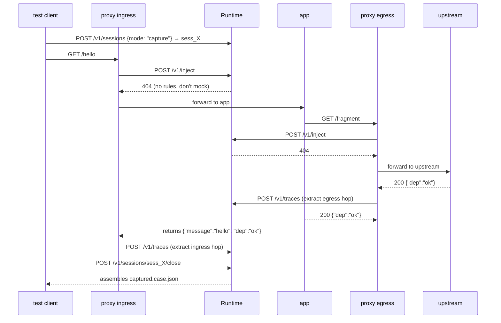
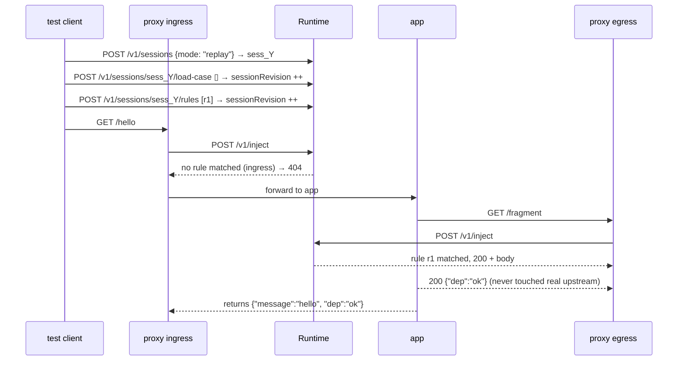

# Capture and replay

Capture and replay are **two modes of the same session**. The physical traffic flow is identical — `client → proxy → app → proxy → dependency` — what changes is whether the proxy's `/v1/inject` calls return hits (replay) or 404s (capture), and whether the runtime persists observed traffic.

## Capture mode

**Goal:** turn one end-to-end run through your system into a committable `*.case.json` file.



### What gets captured

Every HTTP hop that passes through the proxy with `x-softprobe-session-id: $SOFTPROBE_SESSION_ID` attached. For each hop, the case file stores:

- method, URL, and all normalized headers (minus those redacted by policy)
- request and response bodies (subject to size limits configured on the runtime)
- status code, duration
- W3C trace context (`traceparent`, `tracestate`) linking the hops together
- Softprobe attributes (`sp.session.id`, `sp.traffic.direction`)

### What does **not** get captured

- Traffic without the session header (other tenants are ignored).
- Traffic that bypasses the proxy (direct in-cluster calls, backend-to-backend TCP).
- Non-HTTP traffic (gRPC streaming, websockets are roadmap items).

### Where the file lives

The hosted runtime stores captured spans while the session is open. On `close`,
use `softprobe session close --out cases/name.case.json` to download the
assembled case file into your repository.

### Capture pitfalls

**PII leakage.** By default, Softprobe does **not** redact. If your captures flow through a proxy that sees authorization tokens, credit cards, or personal data, add a redaction rule in capture mode or run a post-capture scrubbing hook before committing. See [Write a hook](/guides/write-a-hook).

**Double-capture.** If you already run a production OpenTelemetry pipeline, make sure capture sessions only trigger on tests — use the `x-softprobe-session-id` header as the opt-in marker. Traffic without it is ignored.

**Partial recordings.** If the session closes before all async HTTP completes (e.g. you close right after firing a background request), those hops may be dropped. Use `close` in a `finally`/`afterAll` and ensure your app flushes pending requests before the test ends.

## Replay mode

**Goal:** drive the SUT exactly as in production, but serve dependency responses from the captured case instead of the live world.



::: info Author-time vs request-time
**The runtime never walks `traces[]` on the inject hot path.** Case lookup happens **only** in the SDK via `findInCase`, at the time the test file is written or loaded. What reaches the runtime is a concrete `mock` rule with a fully-materialized response.

This is a hard architectural invariant — not an implementation detail — because it keeps the inject path deterministic, language-neutral, and fast (< 5 ms p99). Anything that feels like "the runtime should decide which captured response to return" belongs in the SDK. See the [design rationale](https://github.com/softprobe/softprobe/blob/main/docs/design.md#53-inject-resolution-placement-normative).
:::

### The author's workflow

Replay is **SDK-authored**. Three SDK calls cover 90% of cases:

```ts
const session = await softprobe.startSession({ mode: 'replay' });
await session.loadCaseFromFile('cases/checkout.case.json');

const hit = session.findInCase({
  direction: 'outbound',
  method: 'POST',
  pathPrefix: '/v1/payment_intents',
  hostSuffix: 'stripe.com',
});

await session.mockOutbound({
  direction: 'outbound',
  method: 'POST',
  pathPrefix: '/v1/payment_intents',
  hostSuffix: 'stripe.com',
  response: hit.response,
});
```

1. **`loadCaseFromFile`** — the SDK parses the case JSON in-memory and also ships it to the runtime so embedded rules can apply.
2. **`findInCase`** — a **synchronous, in-memory** lookup. Returns the one matching captured response, or throws if there are zero or multiple matches (so ambiguity is caught at authoring time, never in a silent runtime miss).
3. **`mockOutbound`** — sends a `then.action: mock` rule to the runtime. From here on, the proxy will return this exact response for any request matching the `when` predicate.

### Why this split? (SDK picks, runtime matches)

Earlier iterations of Softprobe let the runtime "walk the captured traces" at request time to pick a replay response. That sounded elegant and created four bad properties:

| Problem | SDK-picks model fixes it by… |
|---|---|
| Ambiguity surfaced at runtime | …surfacing it when the test is being written. `findInCase` throws immediately. |
| Couldn't mutate the response (timestamp, token) | …returning a `CapturedResponse` object that is plain JS/Python/etc. Mutate freely before passing it to `mockOutbound`. |
| Runtime grew a query engine | …keeping the runtime as a simple `when`/`then` matcher. |
| Cross-language differences in matcher behavior | …moving all of it into each SDK, tested identically against the same fixtures. |

The runtime still matches rules — it just doesn't pick responses from captured traces on the hot path.

### What can live in `findInCase` predicates

| Key | Matches against | Example |
|---|---|---|
| `method` | HTTP method (case-insensitive) | `"POST"` |
| `path` | Exact path | `"/v1/payment_intents"` |
| `pathPrefix` | Path starts with | `"/v1/payment_intents"` |
| `host` | Exact host | `"api.stripe.com"` |
| `hostSuffix` | Host ends with | `"stripe.com"` |
| `direction` | Which leg | `"inbound"` \| `"outbound"` |
| `service` | OTEL `service.name` attribute | `"checkout-api"` |

You combine them with AND semantics. There is no `or` / `not` / regex in v1 — if you need that, do the filtering yourself on the returned spans (advanced usage, exposed via `hit.span`).

### What can live in `mockOutbound` rules

The same predicate keys for the `when`, plus a concrete `response`:

```ts
await session.mockOutbound({
  direction: 'outbound',
  method: 'GET',
  path: '/fragment',
  response: {
    status: 200,
    headers: { 'content-type': 'application/json' },
    body: { dep: 'ok' },   // string or JSON, SDK serializes
  },
  id: 'fragment-mock',   // optional; stable id aids diffs and codegen
  priority: 100,         // higher wins on conflict
});
```

A call to `mockOutbound` **merges** with any rules already applied via this handle, then posts the full rules document to the runtime (v1 runtime replaces the rules array wholesale — the SDK handles the merge for you).

### Strict policy

By default, unmocked outbound traffic is forwarded to the live upstream — useful for hybrid tests where you mock payments but let a local database pass through. In CI you usually want the opposite: any unexpected external call should **fail the test**.

```ts
await session.setPolicy({ externalHttp: 'strict' });
```

With strict policy, any outbound hop without a matching mock rule returns an error to the app, which typically bubbles up as a test failure. This is the fastest way to catch "I forgot to mock X" bugs.

## Comparison: capture vs. replay at a glance

| Question | Capture | Replay |
|---|---|---|
| Who drives the traffic? | The test (real-world) | The test (deterministic) |
| What does the proxy do on inject? | Return 404, forward to real upstream | Return 200 with canned response on match |
| Where does the response come from? | The real upstream | The loaded case + mocks set by the SDK |
| Is state persisted? | Yes — to `*.case.json` on close | No (session state is ephemeral) |
| Is the test deterministic? | No (depends on live upstreams) | Yes |
| Typical use | Record a baseline from staging | Run fast, deterministic tests in CI |

---

**Next:** [Rules and policy →](/concepts/rules-and-policy)
