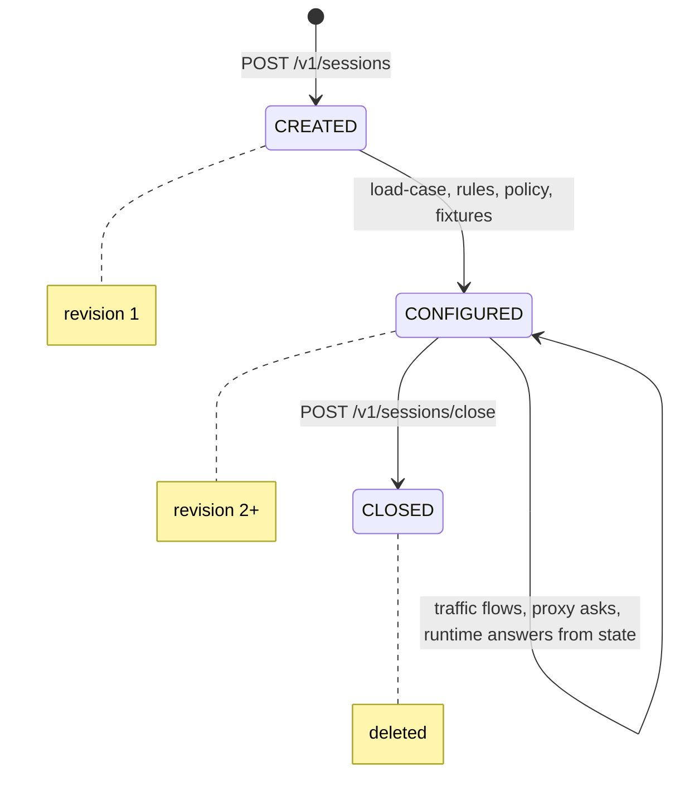
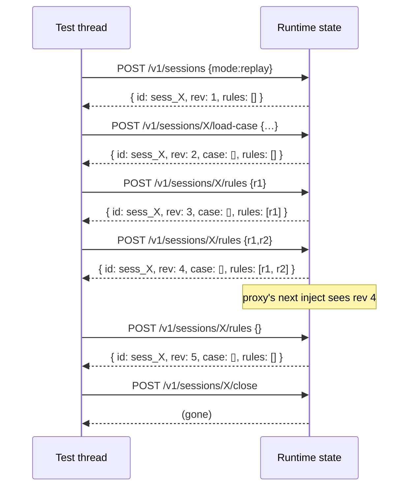

# Sessions and cases

Two objects carry almost all of Softprobe's state: the **session** (transient, lives in the runtime) and the **case** (persistent, lives on disk). Understanding their boundaries is the key to writing tests that are both deterministic and easy to reason about.

## Session

A session is a **bounded test-run context**. It has an id, a mode, a policy, zero or more rules, and optionally a loaded case.

```text
POST /v1/sessions {"mode":"replay"}
  ↓
{
  "sessionId": "sess_01H7P8Q4...",
  "sessionRevision": 1
}
```

You attach that `sessionId` to every HTTP request that should participate in the test by setting the `x-softprobe-session-id` header. The proxy includes that id in every OTLP inject span it sends to the runtime, which is how the runtime knows which rules and which case apply.

### Session fields

| Field | Type | Description |
|---|---|---|
| `sessionId` | UUID-ish string | Returned at session creation; used in all subsequent control calls and in the `x-softprobe-session-id` header. |
| `mode` | `"capture"` \| `"replay"` \| `"generate"` | What the runtime does with observed traffic. See [Capture and replay](/concepts/capture-and-replay). |
| `policy` | object | Defaults for unmocked traffic (`externalHttp: strict` blocks outbound, `allow` passes through). |
| `rules` | array | When/then rules — typically produced by the SDK's `mockOutbound`. |
| `loadedCase` | opaque bytes | The parsed case JSON for `findInCase` lookups (SDK-side). |
| `fixtures` | object | Non-HTTP data like auth tokens that matchers and codegen may reference. |
| `sessionRevision` | monotonic integer | Bumped by every mutating call; used for cache invalidation. |

### Session lifecycle



Every mutating call (`load-case`, `rules`, `policy`, `fixtures`) bumps `sessionRevision`. This is how the proxy safely caches inject decisions: the cache key is `(sessionId, sessionRevision, requestFingerprint)`, so when you call `clearRules()` or `mockOutbound()`, the new revision invalidates all prior hits.

### Session revision, step by step



### When to reuse a session vs. start a new one

**Reuse** when multiple test cases share the same captured baseline and you only swap rules between them (`clearRules` → `mockOutbound`). Fewer round-trips, faster suite.

**Start fresh** when cases have *different* captures, different policies, or you want perfect isolation across a parallel test runner. Parallel test frameworks like Jest's `test.concurrent` need unique `sessionId`s per worker.

## Case

A **case** is a single JSON file that captures one scenario — one end-to-end walk through the system and all the HTTP hops that fell out of it.

### On-disk shape

```json
{
  "version": "1.0.0",
  "caseId": "checkout-happy-path",
  "suite": "payments",
  "mode": "replay",
  "createdAt": "2026-04-15T10:00:00Z",
  "traces": [
    { "resourceSpans": [ /* OTLP ResourceSpans — one per captured hop */ ] }
  ],
  "rules":    [ /* optional default rules */ ],
  "fixtures": [ /* optional auth tokens, service metadata */ ]
}
```

Each entry in `traces[]` is an OTLP **ExportTraceServiceRequest** / **TracesData** payload — the same JSON shape the OpenTelemetry SDKs produce. This is not coincidence: it means a captured case can be piped straight into an OTLP collector for observability, and conversely, traces produced by any OTEL-compatible tool can be hand-assembled into a case.

See the full schema at [`spec/schemas/case.schema.json`](/reference/case-schema).

### What goes into `traces[]`?

Exactly the HTTP hops observed during the session:

| Hop | Direction | Attributes |
|---|---|---|
| `client → proxy → app` | `inbound` | `http.method`, `http.target`, `http.status_code`, request/response bodies |
| `app → proxy → upstream` | `outbound` | `url.full`, `http.method`, `http.status_code`, request/response bodies |

Correlation between legs happens via W3C Trace Context (`traceparent`). Session correlation is carried in `tracestate` — the proxy puts it there on ingress, and any OpenTelemetry-instrumented HTTP client on the app will propagate it through to egress.

### What does **not** go into a case

- Database & Redis queries (that's a future scope, `spec/protocol/db-capture.md` is a placeholder).
- Non-HTTP RPC (gRPC, Kafka are on the roadmap).
- Internal function calls, logs, metrics (on the roadmap).
- Your source code.

### Embedded rules and fixtures

A case can optionally carry **rules** and **fixtures** that should apply whenever it's loaded:

```json
{
  "caseId": "checkout-happy-path",
  "traces": [ /* … */ ],
  "rules": [
    { "id": "redact-auth", "when": { "headerMatch": "authorization" }, "then": { "action": "mock", "response": { "redact": true } } }
  ],
  "fixtures": [
    { "name": "auth_token", "value": "stub_eyJ..." }
  ]
}
```

Embedded rules are applied by the runtime *beneath* any session rules you add via `mockOutbound` — so a test can always override a shipped default.

## Relationship between session and case

A session can **load** a case, but doesn't have to:

| Scenario | Session has a case? | SDK calls |
|---|---|---|
| Replay captured traffic | **Yes** — `loadCaseFromFile()` | `findInCase` + `mockOutbound` |
| Write a quick-mock test from scratch | No | Just `mockOutbound({response: {...}})` |
| Record new traffic | Not at create time; runtime accumulates a case and emits a file on close | No SDK calls needed for capture |

Loading a case is an **SDK-side** action in the sense that the SDK parses the JSON for `findInCase`. The runtime also receives a copy (so case-embedded rules can apply), but the runtime does **not** walk the traces on the hot path. Selection happens in the SDK, materializes as an explicit `mock` rule, and the runtime only matches those rules. See [Capture and replay](/concepts/capture-and-replay) for why this split matters.

## Best practices

**Name cases by business scenario, not by test.** `cases/checkout-happy-path.case.json` is better than `cases/test_checkout_unit_47.case.json`. Two tests should be able to load the same case if they exercise the same scenario.

**Commit cases alongside tests.** Put `cases/` next to your `__tests__/`. Reviewers see capture and test in the same PR diff.

**Regenerate cases deliberately.** When an upstream changes its contract, you should re-capture — the change should be visible in the diff, not hidden inside an out-of-date fixture.

**One scenario per file.** A case file should tell one story. Large captures that mix unrelated flows make `findInCase` ambiguous and reviews hard.

**Close sessions in teardown.** Always. Leaked sessions accumulate in the runtime's memory and eventually exceed configured limits.

---

**Next:** [Capture and replay →](/concepts/capture-and-replay)
