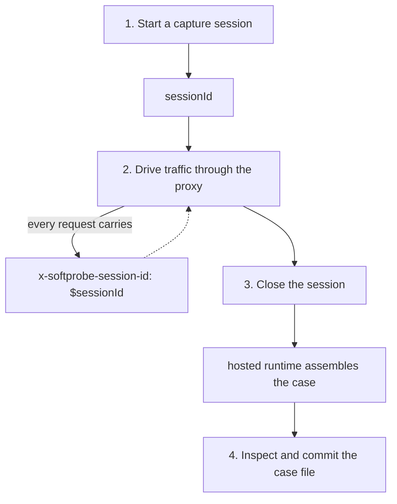

# Capture your first session

By the end of this guide you will have a real `*.case.json` file, committed to your repo, that you can replay from any SDK. The capture step is **language-independent** — it's the same `curl` calls (or CLI commands) no matter what your app or your tests are written in.

**Time:** 10 minutes.
**You need:** `SOFTPROBE_API_TOKEN` set and traffic routed through the Softprobe
proxy. If you don't have that yet, follow [Installation](/installation) first.

## The plan



## 1. Start a capture session

### Using the CLI (recommended)

```bash
softprobe session start --mode capture --json
# {"sessionId":"sess_01H7P8Q4XYZ...","sessionRevision":1}

# Or in a one-liner that exports to the shell:
eval "$(softprobe session start --mode capture --shell)"
echo "Session: $SOFTPROBE_SESSION_ID"
```

`--shell` emits `export SOFTPROBE_SESSION_ID=…` so you can use it in subsequent commands without parsing JSON.

Either way, you now hold a `sessionId` string.

## 2. Drive traffic through the proxy

Two rules:

1. **Every request must carry** `x-softprobe-session-id: $SOFTPROBE_SESSION_ID`.
2. **Every request must route through the ingress proxy** — not direct to the app.

### Manual testing with curl

```bash
curl -v -H "x-softprobe-session-id: $SOFTPROBE_SESSION_ID" \
  http://127.0.0.1:8082/checkout \
  -d '{"amount": 1000, "currency": "USD"}' \
  -H 'content-type: application/json'
```

Port `8082` in the reference stack is the **ingress listener**. The app lives on `8081` directly, but you should not hit it there during capture — the proxy is what observes the hop.

### Driving from a realistic scenario

In real usage you run your app's own integration tests or a staging smoke test:

```bash
# Example: drive a test harness that hits the SUT on :8082 with the session header
SOFTPROBE_SESSION_ID=$SOFTPROBE_SESSION_ID npm run smoke-test

# Or run a browser-based flow
SOFTPROBE_SESSION_ID=$SOFTPROBE_SESSION_ID playwright test --grep "checkout"
```

The constraint is mechanical: whatever is making the HTTP calls must **propagate** the session header. Most HTTP clients accept a per-request header map or a default header config.

### Checking traffic is actually arriving

Query the hosted runtime for span counts:

```bash
softprobe session stats --session "$SOFTPROBE_SESSION_ID" --json | jq
# { "extractedSpans": 2, "injectedSpans": 2 }
```

If `extractedSpans` stays at 0 after you send traffic, your session header isn't reaching the proxy. See [Troubleshooting](/guides/troubleshooting#x-softprobe-session-id-rejected).

## 3. Close the session

Closing assembles the captured traces into a case and deletes the session.

```bash
softprobe session close --session $SOFTPROBE_SESSION_ID --out cases/checkout.case.json
# {"closed": true, "casePath": "cases/checkout.case.json"}
```

## 4. Inspect the capture

Open it. It should be readable JSON:

```bash
jq '.caseId, (.traces | length), (.traces[0].resourceSpans[0].scopeSpans[0].spans | length)' \
   cases/checkout.case.json
# "session-auto-20260420-103022"
# 2
# 1
```

```bash
softprobe inspect case cases/checkout.case.json
# Case: session-auto-20260420-103022
# Traces: 2
# ┌────────────────┬────────┬──────────┬───────────────────────────┐
# │ Direction      │ Method │ Status   │ URL                       │
# ├────────────────┼────────┼──────────┼───────────────────────────┤
# │ inbound  (app) │ POST   │ 200      │ /checkout                 │
# │ outbound       │ POST   │ 200      │ https://api.stripe.com/…  │
# │ outbound       │ GET    │ 200      │ http://fragment/shipping  │
# └────────────────┴────────┴──────────┴───────────────────────────┘
```

This command is useful in CI: feed it a case file and it prints a diff-friendly summary.

### Things to look for

| Check | Why |
|---|---|
| **At least one inbound and one outbound span** | Otherwise the capture only saw one leg — your app may not be routing egress through the proxy. |
| **No leaked secrets** | Scan for `authorization`, credit cards, emails. If present, add a redaction rule next capture or scrub before committing. |
| **Status codes are what you expect** | A `500` captured here will replay as a `500`. |
| **`traceId` is 32 hex chars per span** | Shorter values break OTLP consumers. |

## 5. Commit

```bash
mkdir -p cases
git add cases/checkout.case.json
git commit -m "capture: checkout happy path baseline"
```

::: tip Naming convention
Name by business scenario: `checkout-happy-path`, `checkout-declined-card`, `signup-with-oauth`. Avoid test-oriented names (`test_42.case.json`) — two tests should be able to share the same case if they exercise the same scenario.
:::

## One-shot capture with the CLI

Steps 1–3 collapse into a single command for scripted use:

```bash
softprobe capture run \
  --driver "npm run smoke-test" \
  --target http://127.0.0.1:8082 \
  --out cases/checkout-happy-path.case.json
```

`capture run` starts a session, sets `SOFTPROBE_SESSION_ID` for the driver process, runs it, closes the session, and writes the case file. Useful in CI capture jobs.

## Redacting sensitive data before writing

Capture mode respects `capture_only` rules with a `redact` payload. Apply them before you start driving traffic:

```bash
softprobe session start --mode capture --json > session.json
SOFTPROBE_SESSION_ID=$(jq -r .sessionId session.json)

softprobe session rules apply --session $SOFTPROBE_SESSION_ID \
  --file rules/redact.yaml
```

```yaml
# rules/redact.yaml
version: 1
rules:
  - id: strip-auth
    priority: 100
    when: { direction: outbound }
    then:
      action: capture_only
      captureOnly:
        redactHeaders: [authorization, cookie, x-api-key]
        redactJsonPaths:
          - "$.card.number"
          - "$.user.ssn"
```

Bodies and headers listed here will be replaced with `"[REDACTED]"` in the captured file.

## Capturing from a production canary

Capture is safe for a small fraction of production traffic: the WASM filter mirrors observed bytes asynchronously — the request path itself is unaffected. To capture from production:

1. Deploy your sidecar with `sp_backend_url` pointed at the hosted runtime.
2. On the caller side, set `x-softprobe-session-id` only for the 0.1% of requests you want to sample.
3. Close the session with `softprobe session close --out ...` to download the case.
4. Redact, review, and commit.

See [Kubernetes deployment](/deployment/kubernetes) for the manifests.

## Next

| I want to… | Read |
|---|---|
| Turn this case into a passing test | [Replay in Jest](/guides/replay-in-jest) / [pytest](/guides/replay-in-pytest) / [JUnit](/guides/replay-in-junit) / [Go](/guides/replay-in-go) |
| Rewrite a captured response before replay | [Write a hook](/guides/write-a-hook) |
| Scale to hundreds of cases | [Run a suite at scale](/guides/run-a-suite-at-scale) |
