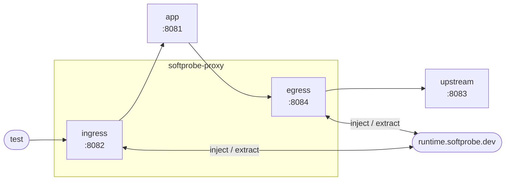
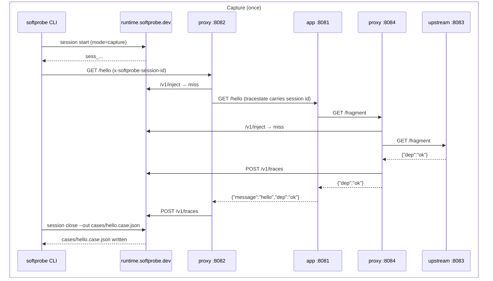
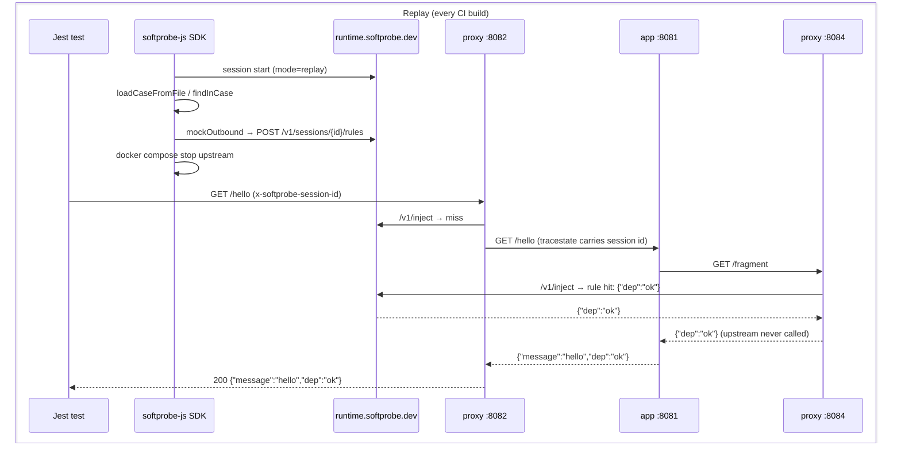

# Quick start

Record real HTTP traffic through Envoy once, commit the case file, then replay it in CI forever — no live dependencies required.

**Time:** ~20 minutes.  
**You need:** Docker 24+, Node.js 20+, Git, a Softprobe account.

---

## 1. Get an API token

Sign up at [https://dashboard.softprobe.ai](https://dashboard.softprobe.ai) and create your API token.

::: tip Where to create the token
If you have no organization yet, create one first. Then select that organization, open **Settings** → **Public Key** → **Create Public Key**. That value is your API token (public key).
:::

Then set it in your shell:

```bash
export SOFTPROBE_API_TOKEN=...
```

Add this to your shell profile (`.zshrc`, `.bashrc`) or CI secret store — every command in this guide reads it.

---

## 2. Install the Softprobe CLI

Follow [Installation: CLI](/installation#cli) to install the `softprobe` binary.

Verify the hosted runtime is reachable (this uses `SOFTPROBE_API_TOKEN` from step 1):

```bash
softprobe doctor
# ✓ runtime reachable at https://runtime.softprobe.dev
# ✓ authenticated as <your-org>
```

---

## 3. Clone the getting-started repo

```bash
git clone https://github.com/softprobe/getting-started
cd getting-started
```

The repo ships a pre-committed case file (`cases/hello.case.json`) so you can skip straight to Step 5 if you want. The capture steps below show how that file was produced.

---

## 4. Start the sample stack

```bash
docker compose up --wait
```

Docker pulls three images on first run (proxy, app, upstream) and starts them:

```
 ✔ softprobe-proxy      started  :8082  (ingress)  :8084 (egress)
 ✔ app                  started  :8081  (sample app under test)
 ✔ upstream             started  :8083  (sample HTTP dependency)
```

**Topology:**



The proxy WASM filter is fetched from GCS on startup and calls the hosted runtime on every intercepted request. No runtime container to manage.

---

## 5. Capture a baseline

The repo includes a pre-captured `cases/hello.case.json`. Run these steps to see how it was produced (or to re-capture after the upstream changes).

Run all three commands in one shell so the session ID stays in scope:

```bash
# Start a capture session against the hosted runtime
eval "$(softprobe session start --mode capture --shell)"
# → sets SOFTPROBE_SESSION_ID=sess_...

# Drive the app through the ingress proxy
curl -s -H "x-softprobe-session-id: $SOFTPROBE_SESSION_ID" http://127.0.0.1:8082/hello
# → {"dep":"ok","message":"hello"}

# Wait for the proxy to finish posting traces asynchronously
sleep 2

# Close the session and download the case file
softprobe session close \
  --session "$SOFTPROBE_SESSION_ID" \
  --out cases/hello.case.json
# → session ... closed
# → wrote cases/hello.case.json
```

Inspect what was captured:

```bash
softprobe inspect case cases/hello.case.json
# traces: 2
# trace 1: spans=1  hosts=softprobe-proxy:8084  directions=outbound
# trace 2: spans=1  hosts=127.0.0.1:8082        directions=outbound
```

Two spans: the egress hop (app → upstream via proxy) and the ingress hop (test → app via proxy). The egress span at `/fragment` is what gets replayed.

Commit the case file:

```bash
git add cases/hello.case.json
git commit -m "capture: hello baseline"
```

---

## 6. Run the replay test

Kill the upstream container to prove no live dependency is needed:

```bash
# Run from the getting-started directory (not softprobe-tests/)
docker compose stop upstream
# Container getting-started-upstream-1  Stopped
```

Now run the test:

```bash
cd softprobe-tests
npm install
npx jest hello.test --verbose
```

```
 PASS  hello.test.ts
  GET /hello
    ✓ returns the captured upstream response without hitting the network (34 ms)
```

The upstream is stopped and the test still passes. The egress proxy intercepted the app's outbound call and returned the captured response from the case file — the real upstream was never contacted. The test's `afterAll` restarts the container so the stack is clean for next time.

**`hello.test.ts`** in the repo:

```ts
import path from 'path';
import { execSync } from 'child_process';
import { Softprobe } from '@softprobe/softprobe-js';

const softprobe = new Softprobe();  // reads SOFTPROBE_API_TOKEN
const CASE_FILE = path.resolve(__dirname, '../cases/hello.case.json');
const APP_URL = process.env.APP_URL ?? 'http://127.0.0.1:8082';

describe('GET /hello', () => {
  let sessionId = '';
  let close: () => Promise<void> = async () => {};

  beforeAll(async () => {
    const session = await softprobe.startSession({ mode: 'replay' });
    sessionId = session.id;
    close = () => session.close();

    await session.loadCaseFromFile(CASE_FILE);

    const hit = session.findInCase({
      direction: 'outbound',
      path: '/fragment',
    });

    await session.mockOutbound({
      name: 'fragment-mock',
      direction: 'outbound',
      path: '/fragment',
      response: hit.response,
    });

    // Stop the upstream to prove the test never hits the real network.
    execSync('docker compose stop upstream', { cwd: path.resolve(__dirname, '..') });
  });

  afterAll(async () => {
    execSync('docker compose start upstream', { cwd: path.resolve(__dirname, '..') });
    await close();
  });

  it('returns the captured upstream response without hitting the network', async () => {
    const res = await fetch(`${APP_URL}/hello`, {
      headers: { 'x-softprobe-session-id': sessionId },
    });

    expect(res.status).toBe(200);
    expect(await res.json()).toEqual({ message: 'hello', dep: 'ok' });
  });
});
```

`beforeAll` stops the `upstream` container before the assertion runs. If the mock were not in place the app would get a connection error and the test would fail. `afterAll` restarts it so the stack is clean for the next run.

---

## 7. Mutate the mock and watch the test fail

The response you're replaying comes from the case file. You own it — you can change it before registering the mock. Open `softprobe-tests/hello.test.ts` and change the `dep` value from `"ok"` to `"not ok"`:

```ts
    await session.mockOutbound({
      name: 'fragment-mock',
      direction: 'outbound',
      path: '/fragment',
      response: {
        ...hit.response,
        body: JSON.stringify({ dep: 'not ok' }),  // override the captured body
      },
    });
```

Run the test again (upstream is still stopped):

```bash
npx jest hello.test --verbose
```

```
 FAIL  hello.test.ts
  GET /hello
    ✕ returns the captured upstream response without hitting the network (38 ms)

  ● GET /hello › returns the captured upstream response without hitting the network

    expect(received).toEqual(expected)

    - Expected
    + Received

      Object {
    -   "dep": "ok",
    +   "dep": "not ok",
        "message": "hello",
      }
```

The test fails because the app's response reflects the mutated mock. Revert the change to restore green. This is the foundation of **mutation testing**: swap the captured fixture for an alternate value to verify your app code actually uses the dependency response rather than ignoring it.

---

## What just happened





**Key mechanics:**

1. **Session ID propagation** — `x-softprobe-session-id` enters on the ingress. The proxy embeds it in W3C `tracestate`. When the app makes an outbound call using OpenTelemetry, `tracestate` carries the session ID to the egress proxy — the app never manually copies it to outbound headers.

2. **Rule matching on egress** — the egress proxy posts `/v1/inject` for each outbound call. The runtime matches it against the session's `mockOutbound` rules and returns the recorded response. The upstream is never contacted.

3. **`findInCase` → `mockOutbound`** — `findInCase` is a pure in-memory lookup that reads the OTLP spans from the case file. `mockOutbound` compiles the result into a `when`/`then` rule and posts it to the runtime. You choose exactly what gets mocked — nothing is auto-replayed.

---

## When to re-capture

Re-run the capture steps (and commit the updated `cases/hello.case.json`) when:
- the upstream API's response format changes
- you want the fixture to reflect a newer response
- a replay assertion fails in a way that indicates real data drift

---

## Next steps

| I want to… | Read |
|---|---|
| Mutate a captured response before mocking (rotate tokens, rewrite bodies) | [Write a hook](/guides/write-a-hook) |
| Run the same suite from the CLI and from Jest | [Run a suite at scale](/guides/run-a-suite-at-scale) |
| Deploy the proxy sidecar in Kubernetes / Istio | [Installation: Proxy](/installation#proxy) |

---

## Troubleshooting

**`docker compose up` exits with "SOFTPROBE_API_TOKEN is not set"** — export the variable before running compose: `export SOFTPROBE_API_TOKEN=...`

**Proxy logs show WASM fetch timeout** — Envoy fetches the WASM filter from GCS on startup. Ensure the container has outbound internet access.

**`softprobe doctor` fails** — your token may be invalid or expired. Get a fresh one at [https://dashboard.softprobe.ai](https://dashboard.softprobe.ai).

**Replay test: `dep` field is `""` instead of `"ok"`** — the session ID is not reaching the egress proxy. Verify the app propagates OpenTelemetry trace context (`traceparent` / `tracestate`) on outbound calls. The session ID travels in `tracestate`; if the app strips it, the egress proxy sees a different session and misses the mock rule.

**`findInCase` throws "no span matches"** — inspect the case file with `softprobe inspect case cases/hello.case.json` to confirm the expected path and direction are present. The egress `/fragment` span has `direction: outbound` and `path: /fragment`.

More at [Troubleshooting](/guides/troubleshooting).
