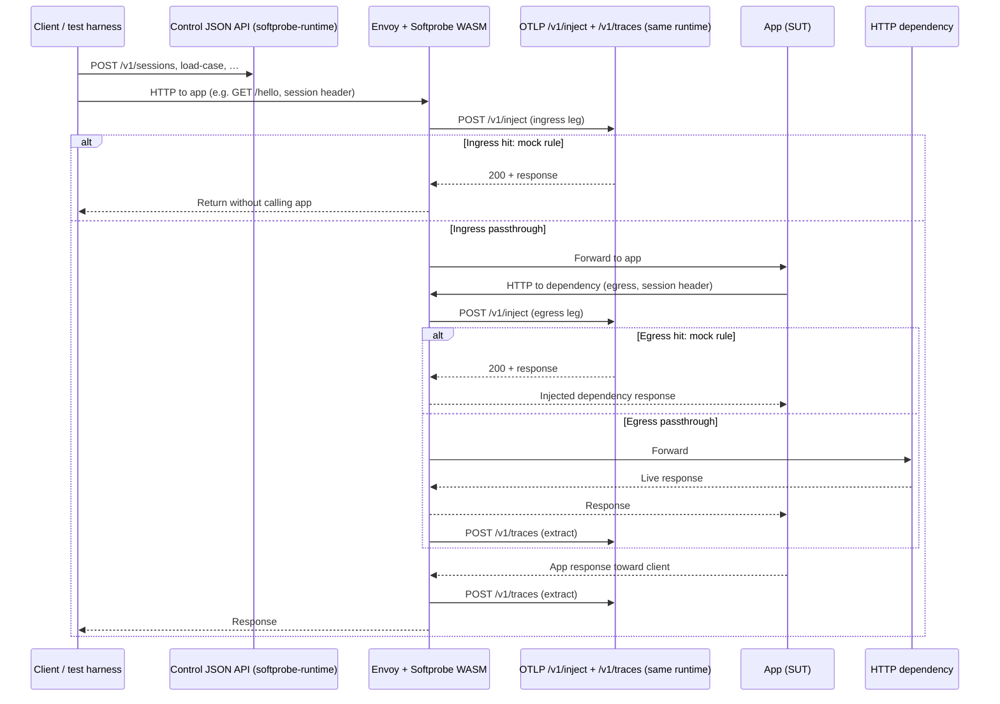

# Softprobe Hybrid Platform: Design Document

**Status:** Draft for implementation planning  
**Audience:** Engineers implementing runtime, proxy extension, SDKs, and CLI  
**Related contracts:** [platform-architecture.md](./platform-architecture.md), [http-control-api.md](../spec/protocol/http-control-api.md), [proxy-otel-api.md](../spec/protocol/proxy-otel-api.md), [session-headers.md](../spec/protocol/session-headers.md), [proxy-integration-posture.md](./proxy-integration-posture.md), [language-instrumentation.md](./language-instrumentation.md)

---

## 1. Executive summary

Softprobe Hybrid unifies **HTTP capture, replay, and rule-based dependency injection** behind a **proxy-first** data plane (Envoy + Softprobe WASM) and a **language-neutral control plane** (session, case, rules, policy). Language-level framework patching (Express, Fastify, `fetch`, database drivers, and so on) is **optional** and out of the default product path, to reduce implementation cost for a small team.

Recorded behavior is stored as **one JSON file per test case**, containing an ordered list of **OpenTelemetry–compatible trace payloads** (not NDJSON streams). The **default path** is a test that uses **`@softprobe/sdk`** only (`Softprobe` → **`startSession`** → **`loadCaseFromFile`** → **`findInCase`** → **`mockOutbound`**) so **raw `fetch` to `/v1/sessions` never appears** in test code; tests set **`x-softprobe-session-id`** on requests to the app.

The **primary product surface for humans, CI, and AI agents** is the **`softprobe` CLI** (doctor + session for ad-hoc use) and the **TypeScript SDK** helpers that mirror the same JSON control API. **Proxy OTLP** ([proxy-otel-api.md](../spec/protocol/proxy-otel-api.md)) stays an integration detail for proxy authors.

This document specifies background, goals, concrete APIs, CLI shape, data artifacts, cross-language ergonomics, and **acceptance criteria** suitable for turning into an engineering task list.

**If you are implementing the stack without prior context:** read **§4.2–§4.6** first (workflows, who calls which API, control endpoint table, spec index, monorepo map), then **§5–§8**.

---

## 2. Background

### 2.1 Prior state

Two implementations evolved in parallel:

- **JavaScript runtime (`softprobe-js`):** Strong deterministic replay and cassette concepts, but high maintenance cost: many framework and library patches (HTTP servers, clients, Postgres, Redis, and so on).
- **Proxy (`softprobe` / Envoy WASM):** Efficient transparent HTTP interception, OTEL-shaped inject/extract wire protocol, but injection lookup was not fully connected to a shared policy engine.

### 2.2 Problem

Instrumenting every framework is not viable as the **default** product for a startup. At the same time, **authentication and other control flows** are often HTTP-based and must be **mocked or replayed** during tests, not only outbound API calls. The platform needs:

- One **canonical** model for HTTP interactions and decisions.
- One **rule system** that applies to both capture and replay.
- A **simple way** for tests written in any mainstream language to **steer** injection without re-implementing matchers in each runtime.

### 2.3 Product thesis

| Layer | Responsibility |
|--------|-----------------|
| **Proxy (data plane)** | Intercept inbound and outbound HTTP; normalize request identity; call **`softprobe-runtime`** for inject/extract per [proxy-otel-api.md](../spec/protocol/proxy-otel-api.md); enforce passthrough / mock / error. |
| **Softprobe Runtime** | **Unified service** (`softprobe-runtime`): serves **both** the HTTP control API (sessions, rules, cases, policy, fixtures) **and** the proxy OTLP API (`/v1/inject`, `/v1/traces`) from one process with a **shared in-memory session store**. `https://runtime.softprobe.dev` is the hosted instance of this same service. |
| **Language SDKs** | Thin clients: create session, set policy, load case, register rules, attach headers; optional helpers for assertions. |
| **CLI** | **Canonical** human, CI, and agent interface: doctor, sessions, capture, replay, inspect, export; **calls** the same HTTP control API as SDKs (it does not replace the runtime). |

### 2.4 Where the APIs run (one unified service)

**`softprobe-runtime` (OSS, unified)** implements **both** API surfaces from a single process:

- **Control API** ([http-control-api.md](../spec/protocol/http-control-api.md)): sessions, `load-case`, rules, policy, fixtures, close — for CLI, SDKs, and tests.
- **Proxy OTLP API** ([proxy-otel-api.md](../spec/protocol/proxy-otel-api.md)): `POST /v1/inject` and `POST /v1/traces` — for the Envoy/WASM data plane.

Both handler groups share a **single in-memory session store** (`internal/store/`). When a test calls `load-case` or `rules`, the inject handler immediately sees the updated state — no sync, no external backend needed.

**Deployment:** `SOFTPROBE_RUNTIME_URL` (CLI/SDK config) and `sp_backend_url` (proxy WASM config) both point to the **same** `softprobe-runtime` base URL in local and self-hosted setups. The hosted service (`https://runtime.softprobe.dev`) is the same unified service with durable storage behind it.

**v1 needs no database.** Add Redis/Postgres only for HA or restart survival (see [platform-architecture.md](./platform-architecture.md) §10.2).

**Future split (not v1 scope):** If inject/extract volume requires independent scaling, the two handler groups can be extracted to separate processes sharing a common datastore. The spec boundaries ([http-control-api.md](../spec/protocol/http-control-api.md) vs [proxy-otel-api.md](../spec/protocol/proxy-otel-api.md)) remain valid in that configuration. Neither service is an Istio-style mesh control plane for Envoy routing — see [platform-architecture.md](./platform-architecture.md).

### 2.5 Instrumentation planes (proxy vs language)

Softprobe is intentionally **hybrid**: HTTP capture and inject can run at the **mesh** (Envoy + Softprobe WASM → `softprobe-runtime` per [proxy-otel-api.md](../spec/protocol/proxy-otel-api.md)), while **in-process** instrumentation (today mainly `softprobe-js`) can cover **non-HTTP** dependencies and environments **without** a mesh.

- **Default for HTTP** in documented tutorials and CI: **proxy-first** plus **session + case + rules** on the unified runtime (§3, §3.2). Language SDKs are thin **control-plane** clients; they do not replace the proxy for transparent HTTP interception.
- **Optional language plane:** Redis, Postgres, and other protocols, or teams that cannot deploy WASM yet. This is **not** the same as making Express/Fastify/`pg` patching **mandatory** for v1 — §3.1 non-goals still forbid that as the default product path. Optional instrumentation is an **advanced** layer for stacks we explicitly support.
- **Customer APM:** Full request/response bodies from the proxy are sent **out-of-band** to **`sp_backend_url`** (hosted or self-hosted runtime), **not** into the customer’s existing Datadog / Honeycomb / New Relic pipeline by default. See [proxy-integration-posture.md](./proxy-integration-posture.md).
- **Node legacy:** NDJSON cassettes and `SOFTPROBE_CONFIG_PATH` / YAML-driven init in `softprobe-js` are **legacy**; the target is runtime-backed sessions and **case JSON** only. See [language-instrumentation.md](./language-instrumentation.md).

---

## 3. Goals

1. **Proxy-first HTTP:** Capture and inject **inbound and outbound** HTTP without requiring application code changes beyond routing traffic through the mesh and propagating **OpenTelemetry W3C Trace Context** on outbound calls (session correlation is carried in `tracestate` as injected by the proxy; see [session-headers.md](../spec/protocol/session-headers.md)).
2. **Case artifacts:** Persist each scenario as **one JSON case file** with a **`traces` array** in **OTLP-compatible JSON** form (see §6), suitable for tooling, diffing, and optional export to collectors.
3. **Cross-language tests:** **Jest, pytest, and JUnit** (and similar) can **control injection** via a **small HTTP API** to the runtime and **session headers** on requests; no requirement to use a specific JS-only API in the application under test.
4. **Flexible rules:** Support **composable rules** (priority, scope, consume behavior, overrides) that combine with recorded traces, not a single flat mock table.
5. **Two execution modes:** **Replay** (deterministic playback + rules) and **Generate** (emit tests + fixtures using the same session and rule model).
6. **Contract-first:** Schemas and protocols in `spec`; proxy and language repos implement **versioned** contracts.
7. **CLI-first simplicity:** One obvious command-line entrypoint; stable **machine-readable** output for automation and AI agents; onboarding docs that favor **copy-paste CLI flows** over raw HTTP for most users.
8. **Progressive disclosure:** The **default happy path** is *create session → load case → run tests with session header*; composable **rules**, **strict policy**, and **case-embedded rules** are documented as advanced layers on top of that path.

### 3.1 Non-goals (v1)

- Mandatory patching of Express, Fastify, Axios, `fetch`, `pg`, Redis clients, and so on.
- Defining a second, parallel mock DSL unrelated to rules + OTEL-shaped spans.
- Replacing Istio/Envoy as the deployment model for the data plane.

### 3.2 Default happy path (replay + Jest, SDK-first)

Tutorials and CI should assume: **one captured case file**, a **hand-written (or AI-generated) test** that calls **`@softprobe/sdk`** (`startSession`, `loadCaseFromFile`, **`findInCase`**, **`mockOutbound`**, `close`) and sets **`x-softprobe-session-id`**. **HTTP to `/v1/sessions` and friends is implemented once**, inside the SDK — not in tests or scaffolding files.

#### 3.2.0 Division of Labour: SDK vs. Runtime

| Concern | SDK (TS / Python / Java) | Runtime (`softprobe-runtime`) |
|---|---|---|
| Parse captured case (OTLP traces → spans) | **Yes** — in-memory via `findInCase` | No (stores opaque bytes for export only) |
| Choose which captured response to replay | **Yes** — test author picks via `findInCase` predicate | No |
| Mutate captured response (timestamps, tokens, …) | **Yes** — returned as a mutable `CapturedResponse` | No |
| Register explicit rules | **Yes** — `mockOutbound(...)` → `POST /rules` | Stores the rules document as given |
| Match live HTTP against `when` predicates | No | **Yes** — on each `/v1/inject` |
| Return `mock` / `error` / passthrough to the proxy | No | **Yes** — deterministic, no case-walking on the hot path |

This replaces the earlier design where the runtime walked OTLP case traces to materialize replay responses. The runtime now only honors explicit `mock` / `error` / `passthrough` / `capture_only` rules; replay authoring is a pure SDK-side concern.

**Prerequisites (unchanged):** runtime + mesh up; **`softprobe doctor`** green; app uses **OpenTelemetry** on outbound so **`traceparent` / `tracestate`** reach the egress proxy ([session-headers.md](../spec/protocol/session-headers.md)).

**Step 1 — The dependency mock (what authors search for):** after `startSession` and `loadCaseFromFile`, **one outbound mock** is expressed **only** through the SDK. `mockOutbound` compiles internally to **`POST /v1/sessions/{sessionId}/rules`** with a single **`when` / `then: mock`** rule ([rule.schema.json](../spec/schemas/rule.schema.json)); **`hostSuffix`** is expanded to a concrete `when.host` or matcher list inside the SDK if the schema does not yet carry suffix fields.

```typescript
// After: const session = await softprobe.startSession({ mode: 'replay' });
// and:   await session.loadCaseFromFile('…/checkout.case.json');

await session.mockOutbound({
  method: 'POST',
  pathPrefix: '/v1/payment_intents',
  hostSuffix: 'stripe.com',
  response: { status: 200, body: { id: 'pi_test', status: 'succeeded' } },
});
```

**Style note:** the same call is written **`await softprobe.attach(sessionId).mockOutbound({ … })`** when **`sessionId`** already exists (CLI export, prior step). `attach` returns the same **`SoftprobeSession`** type as **`startSession`**.

**Egress replay from case** uses **`findInCase`** (pure, in-memory lookup against the loaded case) together with **`mockOutbound`**:

```typescript
// Find the single captured /fragment response in the loaded case.
const hit = session.findInCase({
  direction: 'outbound',
  method: 'GET',
  path: '/fragment',
});

// Mutate freely before registering — e.g. bump a timestamp or rotate a token.
const body = JSON.parse(hit.response.body);
body.servedAt = new Date().toISOString();

await session.mockOutbound({
  direction: 'outbound',
  method: 'GET',
  path: '/fragment',
  response: {
    status: hit.response.status,
    headers: hit.response.headers,
    body,
  },
});
```

**`findInCase`** is a **synchronous, zero-network, test-author-facing lookup**. It throws when zero or more than one span in the loaded case matches, surfacing ambiguity at authoring time rather than as a silent runtime miss.

#### 3.2.1 From `mockOutbound` to the next dependency response

This is the **causal chain** implementers should document in SDK READMEs; it is **not** “Envoy cached the upstream HTTP body.”

1. **`mockOutbound`** ends in **`POST /v1/sessions/{sessionId}/rules`** with JSON that conforms to [session-rules.request.schema.json](../spec/schemas/session-rules.request.schema.json). The runtime stores that payload on the **session record** in memory (same store the OTLP handler reads). **No rule payload is pushed into Envoy** by these calls.

2. When the **app** later issues an **outbound** HTTP call through the mesh, the **proxy** sends **`POST /v1/inject`** with an OTLP **inject** span describing that hop. The runtime **matches** that span against **policy**, **case-embedded rules**, and **session rules** (§8.3). On a **mock** rule hit it returns **`200`** + OTLP attributes (e.g. **`http.response.body`**) built from the rule; on **miss** (or `passthrough` / `capture_only`) it returns **`404`** and the proxy forwards to the **real** upstream. The runtime **does not walk OTLP case traces** on the hot path — case-based replay happens entirely in the SDK via `findInCase`.

3. **Wording:** the runtime holds **session state** used for **inject evaluation**. Use **“inject hit / session rules”**, not **“cached upstream response”**, except when referring explicitly to the **optional proxy-side inject decision cache** in §8.4 (which must invalidate on **`sessionRevision`** change).

**Replace semantics for `POST …/rules` (v1 OSS):** the runtime **replaces** the entire session `rules` blob on each call ([`ApplyRules`](../softprobe-runtime/internal/store/store.go)). The SDK **`mockOutbound`** must therefore **merge** new rules with any rules already applied in-process (or re-fetch before write) so consecutive calls **accumulate** behaviour unless the author calls **`clearRules`**.

#### 3.2.2 Cleaning up session state and invalidating inject behaviour

| Action | Control API | Effect |
|--------|-------------|--------|
| **End the session** | **`POST /v1/sessions/{id}/close`** via **`await session.close()`** | Session **deleted**; **`/v1/inject`** for that id must not find session state (unknown / closed). **Default teardown** in `afterAll`. |
| **Clear mocks/replay rules only** | **`POST …/rules`** with **`{ "version": 1, "rules": [] }`** via **`await session.clearRules()`** (SDK) | **Removes** all session-local rules while keeping **`sessionId`**, **`load-case`**, and policy/fixtures. Bumps **`sessionRevision`**. |
| **Reload case or replace rules** | `load-case` / `rules` / `policy` / `fixtures` | Each bumps **`sessionRevision`**; any **proxy inject cache** keyed per §8.4 must treat stale entries as invalid. |

**Step 2 — `@softprobe/sdk` surface (normative for implementers):** all **`/v1/sessions`**, **`/load-case`**, **`/rules`**, **`/policy`**, **`/close`** live **here only**. Tests **must not** duplicate `fetch`.

```typescript
// @softprobe/sdk — public API (implement in softprobe-js; one HTTP client)

export class Softprobe {
  constructor(private readonly opts?: { baseUrl?: string }) {}

  /** POST /v1/sessions → `new SoftprobeSession(sessionId, baseUrl)` */
  async startSession(body: { mode: 'capture' | 'replay' | 'generate' }): Promise<SoftprobeSession> {
    throw new Error('implement');
  }

  /** No extra HTTP — bind an existing `sessionId` for more `findInCase` / `mockOutbound` calls. */
  attach(sessionId: string): SoftprobeSession {
    throw new Error('implement');
  }
}

export interface CapturedResponse {
  status: number;
  headers: Record<string, string>;
  body: string;
}

export interface CapturedHit {
  response: CapturedResponse;
  span: unknown; // the raw OTLP span, exposed for advanced assertions
}

export interface CaseSpanPredicate {
  method?: string;
  path?: string;
  pathPrefix?: string;
  host?: string;
  hostSuffix?: string;
  direction?: 'inbound' | 'outbound';
  service?: string;
}

export class SoftprobeSession {
  /** From `POST /v1/sessions` response (`sessionId`). */
  constructor(readonly id: string, private readonly _baseUrl: string) {}

  /** POST /v1/sessions/{id}/load-case; also keeps a parsed copy for `findInCase`. */
  async loadCaseFromFile(casePath: string): Promise<void> {
    throw new Error('implement');
  }

  /**
   * Pure, synchronous, in-memory lookup against the case most recently loaded
   * via `loadCaseFromFile`. Returns the materialized captured response and the
   * raw OTLP span. Throws when zero or more than one span matches, so authors
   * disambiguate at authoring time rather than seeing a silent runtime miss.
   */
  findInCase(predicate: CaseSpanPredicate): CapturedHit {
    throw new Error('implement');
  }

  /**
   * POST /v1/sessions/{id}/rules — builds one mock rule, **merges** with rules
   * already applied on this handle, then sends the **full** rules document (§3.2.1).
   *
   * Typical replay authoring: grab a `CapturedHit` via `findInCase`, mutate
   * `hit.response` as needed, then pass it here.
   */
  async mockOutbound(spec: {
    method?: string;
    path?: string;
    pathPrefix?: string;
    host?: string;
    hostSuffix?: string;
    direction?: 'inbound' | 'outbound';
    response: { status: number; body?: unknown; headers?: Record<string, string> };
    id?: string;
    priority?: number;
  }): Promise<void> {
    throw new Error('implement');
  }

  /** POST …/rules with empty `rules` array — clears session-local mock rules (§3.2.2). */
  async clearRules(): Promise<void> {
    throw new Error('implement');
  }

  /** POST /v1/sessions/{id}/close */
  async close(): Promise<void> {
    throw new Error('implement');
  }
}
```

**Step 3 — Jest test** wires session setup + SUT request using only the SDK:

```typescript
// test/checkout.replay.test.ts
import request from 'supertest';
import path from 'path';
import { app } from '../src/app';
import { Softprobe } from '@softprobe/softprobe-js';

describe('checkout replay', () => {
  let sessionId: string;
  let close: () => Promise<void>;

  beforeAll(async () => {
    const softprobe = new Softprobe();
    const session = await softprobe.startSession({ mode: 'replay' });
    await session.loadCaseFromFile(path.join(__dirname, '../cases/checkout.case.json'));

    const fragmentHit = session.findInCase({ direction: 'outbound', method: 'GET', path: '/fragment' });
    await session.mockOutbound({ direction: 'outbound', method: 'GET', path: '/fragment', response: fragmentHit.response });

    sessionId = session.id;
    close = () => session.close();
  });

  afterAll(async () => { await close(); });

  it('serves captured ingress + replayed egress', async () => {
    await request(app)
      .get('/hello')
      .set('x-softprobe-session-id', sessionId)
      .expect(200)
      .expect((res) => {
        expect(res.body).toEqual(expect.objectContaining({ message: 'hello', dep: 'ok' }));
      });
  });
});
```

**Policy and fixtures:** use a **sidecar YAML** next to the case and apply it via `session.setPolicy(…)` / `session.setAuthFixtures(…)` in the `beforeAll` block — tests stay unchanged.

### 3.3 Operational complexity and mitigations

Proxy + mesh + runtime is **more moving parts** than an in-process mock library. The product mitigates that with:

- **`softprobe doctor`**: runtime URL, reachability, expected headers, **spec/schema version** alignment.
- **Opinionated local setups**: documented “one command” or compose profiles where feasible.
- **Single canonical CLI** (see §9): same verbs in CI and on a laptop, so docs and agents do not fork per language.

**Trace context propagation** remains the main integration risk: maintain **one golden-path diagram** (test → ingress with session header → proxy injects `traceparent`/`tracestate` → app → outbound with OTel → mesh) and a single **troubleshooting** section for misconfigured propagators or broken `tracestate`.

### 3.4 Subject under test: application and dependencies (not the proxy)

**Canonical HTTP topology (mesh / sidecar):**

```text
client → proxy → app → proxy → upstream (dependency)
```

The **same logical proxy** (typically one Envoy sidecar paired with the app) intercepts **both**:

- **Ingress:** **client → proxy → app** — every inbound request and response to the application.
- **Egress:** **app → proxy → upstream** — every outbound request and response from the app to HTTP dependencies (payment APIs, auth, SaaS, other internal services).

On each hop the proxy sees the full **request and response** and delegates **inject** / **extract** to **`softprobe-runtime`** over OTLP ([proxy-otel-api.md](../spec/protocol/proxy-otel-api.md)). **Envoy + Softprobe WASM is not the system under test**; it is **only** the capture and inject surface.

**What a case file represents:**

- **Inbound application I/O:** traffic **to** the app (what callers send, what the app returns).
- **Outbound dependency I/O:** traffic **from** the app **to** other HTTP services (what the app sends, what comes back).

Tests and CI drive **`softprobe-runtime`** via the **JSON control API** (sessions, `load-case`, policy, rules). The app must route **both** ingress and egress HTTP through the mesh. **Inbound** from tests carries **`x-softprobe-session-id`**; **outbound** from the app must use **OpenTelemetry** to propagate **`traceparent` / `tracestate`** (session correlation is carried inside `tracestate` per the proxy), per [session-headers.md](../spec/protocol/session-headers.md). The **proxy ↔ runtime OTLP** path is an **integration contract** for proxy authors, not what application developers “test against.”

The root **`e2e/`** harness models this chain with **one Envoy** and **two listeners** (ingress port and egress port): see [e2e/README.md](../e2e/README.md).

---

## 4. Core concepts

### 4.1 Definitions

| Term | Definition |
|------|------------|
| **Session** | A bounded test run context: holds `mode`, **policy**, **loaded case bytes**, **session rules**, and optional **fixtures**. Identified by `sessionId` (returned from `POST /v1/sessions`). |
| **Case** | One JSON document: metadata + **`traces[]`** (OTLP-compatible trace payloads) + optional embedded **`rules[]`** and **`fixtures[]`**. Validated by [case.schema.json](../spec/schemas/case.schema.json). |
| **Rule** | A **`when`** matcher + **`then`** action (**`mock`**, **`error`**, **`passthrough`**, **`capture_only`** on the inject path). Shape defined by [rule.schema.json](../spec/schemas/rule.schema.json); session rules are applied via `POST /v1/sessions/{id}/rules`. Case-backed “replay” in tests is **`findInCase` + `mockOutbound`**, which still emits **`mock`** rules. |
| **Policy** | Session-level defaults (e.g. `externalHttp: strict` vs allow). Applied via `POST /v1/sessions/{id}/policy`. |
| **Inject lookup** | On each intercepted HTTP hop, the **proxy** builds an OTLP **`TracesData`** inject request and **`POST`s** **`/v1/inject`** on the **proxy OTLP API** ([proxy-otel-api.md](../spec/protocol/proxy-otel-api.md)). The backend returns **`200`** + response attributes (hit) or **`404`** (miss → forward upstream). |
| **Extract** | After observing traffic (especially on passthrough), the proxy **`POST`s** OTLP **`TracesData`** to **`/v1/traces`** so the runtime can record **extract** spans in **capture** mode. |

### 4.2 End-to-end workflows

The same physical HTTP flow applies in both modes: **client → proxy → app → proxy → dependency**. What changes is **session `mode`**, what the runtime **stores**, and whether **`/v1/inject`** returns a **hit** (mock) or **miss** (forward).

#### 4.2.1 Capture workflow (record a case)

Goal: persist **ingress + egress** HTTP as OTLP-shaped spans into **one case file** for later replay or inspection.

| Step | Actor | Action |
|------|--------|--------|
| 1 | Operator / CI | Ensure **`softprobe-runtime`** is reachable and Envoy/WASM uses **`sp_backend_url`** pointing at that runtime’s OTLP base URL (same host as control API in OSS; see §2.4). |
| 2 | Test or script | **`POST /v1/sessions`** with `"mode":"capture"` → save **`sessionId`**. |
| 3 | Test client | Send traffic **to the app through the ingress proxy**, header **`x-softprobe-session-id: <sessionId>`** ([session-headers.md](../spec/protocol/session-headers.md)). |
| 4 | App | Handles requests; for **outbound** dependency calls, use **OpenTelemetry** so **`traceparent` / `tracestate`** (with session in `tracestate` per proxy) reach the **egress** proxy hop. |
| 5 | Proxy + runtime | On each hop: **`/v1/inject`** may run (implementation-specific); on **passthrough**, after the real response, proxy sends **`/v1/traces`** **extract** payloads. Runtime **buffers** spans associated with the session. |
| 6 | Test or script | **`POST /v1/sessions/{sessionId}/close`** → runtime **flushes** buffered traces into a **case JSON** file (path configured per deployment; reference harness writes under `e2e/`). |

**Implementer note:** Exact flush trigger and file path are deployment/product choices; the invariant is **close (or explicit flush) yields a `case.schema.json`-compatible artifact**.

#### 4.2.2 Replay workflow (use a case + rules)

Goal: drive tests where **some** HTTP is satisfied from **stored traces / rules** without hitting live upstreams, controlled explicitly via **loaded case** and **`rules` / `policy`**.

| Step | Actor | Action |
|------|--------|--------|
| 1 | Test or script | **`POST /v1/sessions`** with `"mode":"replay"` → **`sessionId`**. |
| 2 | Test or script | **`POST /v1/sessions/{id}/load-case`** with JSON body = **full case document** (same top-level shape as a `.case.json` file; request schema is [session-load-case.request.schema.json](../spec/schemas/session-load-case.request.schema.json), an alias of [case.schema.json](../spec/schemas/case.schema.json)). |
| 3 | Test or script | Optionally **`POST …/policy`** and **`POST …/rules`** to set **strictness** and **when/then** decisions (§8). |
| 4 | Test client | Same as capture: call app **through ingress** with **`x-softprobe-session-id`**. |
| 5 | Proxy + runtime | For each hop, **`/v1/inject`**: runtime matches OTLP inject span against session **policy + case + rules**; **`200`** → proxy synthesizes response; **`404`** → forward to real app/upstream. |
| 6 | Test or script | **`POST …/close`** when done. |

**Jest default:** steps **1–3** (and often **6**) are written directly in the test using the SDK (§3.2); the test calls `startSession`, `loadCaseFromFile`, `findInCase`, `mockOutbound` without raw `fetch` calls.

### 4.3 Two API surfaces (who calls whom)

Implementers must keep these **separate in their heads** even when both are served by **one OSS process** (`softprobe-runtime`):

| Surface | Protocol | Typical callers | Purpose |
|---------|----------|-----------------|--------|
| **Control API** | JSON over HTTP, `Content-Type: application/json` | **`softprobe` CLI**, **language SDKs**, CI scripts | Create sessions, **load-case**, **rules**, **policy**, **fixtures**, **close**. Spec: [http-control-api.md](../spec/protocol/http-control-api.md). Payloads validated by `spec/schemas/session-*.schema.json`. |
| **Proxy OTLP API** | OTLP **protobuf or JSON** (`TracesData`) | **Envoy + Softprobe WASM only** | **Request-path** `POST /v1/inject`; **async** `POST /v1/traces` for extract. Spec: [proxy-otel-api.md](../spec/protocol/proxy-otel-api.md). |

**Hard rules:**

1. **Tests never call `/v1/inject` directly** in normal product use; only the **proxy** does.
2. **The proxy does not call the control JSON API** on the hot path; it only calls **`/v1/inject`** and **`/v1/traces`**.
3. **Both** APIs read/write the **same in-memory session store** in the OSS unified runtime, so **`load-case` / `rules`** visible to inject **immediately** after HTTP `200` (no separate sync).

**Base URL:** In local OSS setups, **`SOFTPROBE_RUNTIME_URL`** (control) and **`sp_backend_url`** (proxy) should be the **same origin** (e.g. `http://127.0.0.1:8080`). Hosted split deployments may differ; the **contract** is still the two specs above.

### 4.4 Control API reference (quick)

All under **`{runtimeBase}/v1/…`**. Request/response JSON Schemas live in **`spec/schemas/`**; errors for unknown sessions use [session-error.response.schema.json](../spec/schemas/session-error.response.schema.json).

| HTTP | Path | Purpose |
|------|------|---------|
| `POST` | `/v1/sessions` | Create session (`mode`, …). Returns `sessionId`, `sessionRevision`. |
| `POST` | `/v1/sessions/{sessionId}/load-case` | Replace loaded case bytes for the session; bumps **revision**. |
| `POST` | `/v1/sessions/{sessionId}/rules` | Replace session rules document (`{ "rules": [ … ] }`); bumps revision. |
| `POST` | `/v1/sessions/{sessionId}/policy` | Set session policy; bumps revision. |
| `POST` | `/v1/sessions/{sessionId}/fixtures/auth` | Attach auth fixtures; bumps revision. |
| `POST` | `/v1/sessions/{sessionId}/close` | End session; capture mode may flush case file. |

**`sessionRevision`:** Every mutating control call increments it. Any proxy-side caching of inject decisions **must** key on **`(sessionId, sessionRevision, requestFingerprint)`** (§8.4).

### 4.5 Normative specs (reading order for implementers)

1. **[session-headers.md](../spec/protocol/session-headers.md)** — inbound session header, W3C trace context, what the app must propagate.
2. **[http-control-api.md](../spec/protocol/http-control-api.md)** — control endpoints list (details in JSON Schemas).
3. **[proxy-otel-api.md](../spec/protocol/proxy-otel-api.md)** — inject/extract OTLP shapes, `200`/`404`, attribute names for HTTP.
4. **[case-otlp-json.md](../spec/protocol/case-otlp-json.md)** and **`spec/schemas/case.schema.json`** / **`case-trace.schema.json`** — case file OTLP profile and JSON Schema.
5. **[rule.schema.json](../spec/schemas/rule.schema.json)** — `when` / `then` vocabulary for dependency decisions (§8).

### 4.6 Reference layout in this monorepo

| Area | Path (approx.) | Responsibility |
|------|----------------|------------------|
| Control + OTLP server | `softprobe-runtime/` | HTTP control API + `POST /v1/inject` + `POST /v1/traces`; shared `internal/store/`. |
| Proxy extension | `softprobe-proxy/` | Envoy WASM filter; calls `sp_backend_url` OTLP endpoints. |
| Contracts | `spec/` | Schemas, `http-control-api.md`, `proxy-otel-api.md`. |
| First-stage SDK | `softprobe-js/` | TypeScript client + Jest examples (§7.0). |
| Golden mesh harness | `e2e/` | Docker Compose: runtime + Envoy + sample app + upstream + tests. |

---

## 5. Architecture

### 5.1 Control flow (replay mode)

**Topology reminder:** `client → proxy → app → proxy → dependency`. The proxy participates **twice**: once on **ingress** (toward the app), once on **egress** (toward dependencies). Each leg can **inject**, **passthrough**, or **error** per policy; passthrough responses are followed by **extract** uploads.



**“App”** is the SUT. **“HTTP dependency”** is any live upstream host the app calls **outbound**—not the proxy and not the runtime. Capture stores **both** legs in **`traces[]`** (per OTLP profile).

### 5.2 Split of responsibilities

- **Application workload:** The SUT. Receives inbound HTTP via the mesh and issues outbound HTTP to dependencies; its **observable HTTP behavior** (in + out) is what capture/replay targets.
- **Proxy:** Delegates inject/extract to **`softprobe-runtime`** over OTLP trace payloads; does not call the JSON control API on the request path.
- **`softprobe-runtime` (OTLP handler):** Owns request-path **inject** resolution, extract handling, and replay/match semantics for mesh traffic (per [proxy-otel-api.md](../spec/protocol/proxy-otel-api.md)); reads from the **same in-memory store** as the control API handlers — no sync required.
- **`softprobe-runtime` (control handler):** Owns the **HTTP control API** for tests and CLI; writes to the same in-memory store that the OTLP inject handler reads.
- **SDKs (first stage: TypeScript + Jest):** Own **ergonomics** and **authoring** (build session objects, compile friendly calls into **control API** payloads for `load-case`, `rules`, `policy`, `fixtures`). The **canonical contract** remains JSON over HTTP per [http-control-api.md](../spec/protocol/http-control-api.md). **Python** and **Java** SDKs follow the same contract after the TS/Jest reference path is stable (see [repo-layout.md](repo-layout.md) §2).
- **CLI:** **Calls** the HTTP control API on the unified runtime; preferred way for agents and operators to create sessions, load cases, and apply rule packs without hand-crafting JSON requests.

### 5.3 Inject resolution placement (normative)

**Inject is resolved inside (or directly adjacent to) the data plane** as follows:

1. **Envoy + WASM** sends **`POST /v1/inject`** to **`softprobe-runtime`** with OTLP-shaped span data (per [proxy-otel-api.md](../spec/protocol/proxy-otel-api.md)).
2. The **OTLP handler** reads **only** session-scoped material already stored via the **control API** (`load-case`, `rules`, `policy`, …) and performs **lookup and composition** (precedence per §8.3) over that stored data.

**Materialization model:** **`@softprobe/sdk`** exposes **`SoftprobeSession.loadCaseFromFile`**, **`findInCase`**, **`mockOutbound`**, **`clearRules`**, **`close`**, and so on; those methods are the **only** supported way to turn **author intent** into **`POST …/rules` / `load-case`** payloads. **`mockOutbound` pushes rule documents into the runtime session store**; the **next** matching **`/v1/inject`** from the proxy **reads** that store and returns OTLP **hit** attributes (it does **not** mean “the upstream once responded and was cached at TCP layer”). **Case-based replay is performed client-side** by `findInCase` and then materialized as an explicit `mock` rule, so the runtime never walks OTLP case traces on the hot path. **Generated Jest modules** and **tests** call only these SDK methods—**not** raw `fetch` to `/v1/sessions`. The runtime remains a **small, deterministic interpreter** over stored JSON, not a host for user-supplied script engines.

---

## 6. Case file format (replaces NDJSON cassettes)

### 6.1 File model

- **One file per case**, e.g. `cases/login-with-oauth.case.json`.
- Top-level shape aligns with [case.schema.json](../spec/schemas/case.schema.json): `version`, `caseId`, `traces`, optional `suite`, `mode`, `rules`, `fixtures`, `createdAt`.
- Each entry in `traces[]` follows the OTLP JSON profile in [case-otlp-json.md](../spec/protocol/case-otlp-json.md).

### 6.2 Traces array

- **`traces`** is an **array of OTLP-compatible trace documents**.
- **Recommended encoding:** JSON equivalent of OTLP **`ExportTraceServiceRequest`** / **`TracesData`** resource-spans structure as produced by standard OTEL SDKs or the Softprobe recorder, so the same payload can be:
  - written to disk,
  - sent to an OTEL backend,
  - re-used for inject span construction.

**Illustrative shape** (logical, not normative field-for-field):

```json
{
  "version": "1.0.0",
  "caseId": "checkout-happy-path",
  "suite": "payments",
  "mode": "replay",
  "createdAt": "2026-04-05T12:00:00Z",
  "traces": [
    {
      "resourceSpans": [
        {
          "resource": { "attributes": [{ "key": "service.name", "value": { "stringValue": "api" } }] },
          "scopeSpans": [
            {
              "spans": [
                {
                  "traceId": "…",
                  "spanId": "…",
                  "name": "HTTP POST",
                  "attributes": [
                    { "key": "sp.session.id", "value": { "stringValue": "sess_abc" } },
                    { "key": "sp.traffic.direction", "value": { "stringValue": "outbound" } },
                    { "key": "url.full", "value": { "stringValue": "https://api.stripe.com/v1/payment_intents" } }
                  ]
                }
              ]
            }
          ]
        }
      ]
    }
  ],
  "rules": []
}
```

**Normative mapping** for specific attributes remains aligned with [proxy-otel-api.md](../spec/protocol/proxy-otel-api.md) (e.g. `sp.session.id`, `sp.traffic.direction`, `http.request.*`, `http.response.*`).

### 6.3 Optional embedded rules

Cases may ship **default rules** (e.g. redact tokens) that the runtime applies unless the session **explicitly disables** `case.rules` or supplies higher-priority overlays.

---

## 7. How tests control HTTP injection (Jest, pytest, JUnit)

### 7.0 First-stage SDK focus (TypeScript + Jest)

**Product and documentation priority for v1 SDK work:** **`softprobe-js`** (TypeScript) with **Jest** as the reference test runner. Tutorials, golden examples, and new ergonomic APIs (for example session helpers that compile to `rules` / `load-case`) ship here first. **pytest** and **JUnit** examples in this document remain **illustrative** of the same control API; they are not required to move in lockstep until the TS/Jest path is proven in CI.

### 7.1 Mechanism

Tests do **not** call Envoy directly. They:

1. **Start or attach to** a **Softprobe Runtime** process (local sidecar, testcontainer, or cluster service for advanced setups).
2. **Create a session** with desired `mode` (`capture` | `replay` | `generate`) and **policy**.
3. **Load a case** and/or **register mocks** through **`@softprobe/sdk`** (`SoftprobeSession.loadCaseFromFile`, **`findInCase`**, **`mockOutbound`**, …), which is the **only** supported way to hit the [HTTP control API](../spec/protocol/http-control-api.md) from TypeScript tests; do not duplicate `fetch` in tests.
4. Ensure **every HTTP request** that should participate carries:

   - `x-softprobe-session-id: <sessionId>` (required per [session-headers.md](../spec/protocol/session-headers.md))
   - Optional: `x-softprobe-case-id`, `x-softprobe-mode`, `x-softprobe-test-name`

5. Run the scenario. The **proxy** includes the session id in OTEL inject/extract spans so the runtime can correlate.

6. **Applications** use **OpenTelemetry** to propagate **W3C `traceparent` / `tracestate`** on outbound HTTP. The proxy places session correlation into that trace context; apps must **not** manually forward `x-softprobe-session-id` on dependency calls ([session-headers.md](../spec/protocol/session-headers.md)).

### 7.2 Jest — SDK-first (see §3.2)

The **normative Jest story** is **§3.2**: use **`Softprobe` + `findInCase` + `mockOutbound`** directly in the test — no raw `/v1/sessions` in the test file.

```typescript
import request from 'supertest';
import { Softprobe } from '@softprobe/sdk';
import { app } from '../src/app';

describe('checkout ad-hoc', () => {
  let sessionId: string;
  let close: () => Promise<void>;

  beforeAll(async () => {
    const softprobe = new Softprobe();
    const session = await softprobe.startSession({ mode: 'replay' });
    await session.loadCaseFromFile(`${__dirname}/../cases/checkout.case.json`);

    await session.mockOutbound({
      method: 'POST',
      pathPrefix: '/v1/payment_intents',
      hostSuffix: 'stripe.com',
      response: { status: 200, body: { id: 'pi_test', status: 'succeeded' } },
    });

    sessionId = session.id;
    close = () => session.close();
  });

  afterAll(async () => {
    await close();
  });

  it('charges', async () => {
    await request(app)
      .post('/checkout')
      .set('x-softprobe-session-id', sessionId)
      .send({ amount: 1000 })
      .expect(200);
  });
});
```

(`mockOutbound` maps to **`then.action: mock`** and **`response`** per [rule.schema.json](../spec/schemas/rule.schema.json).)

**Key point:** The **test harness** sends **`x-softprobe-session-id`** on **inbound** calls (test client → app / ingress). The **proxy** folds that into **W3C Trace Context** (`traceparent`, `tracestate`) on requests forwarded to the app. The **application** must propagate **OpenTelemetry** on **outbound** HTTP—see [session-headers.md](../spec/protocol/session-headers.md).

### 7.3 pytest example (illustrative)

```python
import os
import pytest
import requests
from softprobe import Client

@pytest.fixture
def softprobe_session():
    client = Client(base_url=os.environ["SOFTPROBE_RUNTIME_URL"])
    session = client.sessions.create(
        mode="replay",
        policy={"externalHttp": "strict", "defaultOnMiss": "error"},
    )
    session.load_case(path="cases/checkout.case.json")
    yield session
    session.close()

def test_checkout(softprobe_session):
    headers = {"x-softprobe-session-id": softprobe_session.id}
    r = requests.post("http://app-under-test/checkout", json={"amount": 1000}, headers=headers)
    assert r.status_code == 200
```

### 7.4 JUnit 5 example (illustrative)

```java
@ExtendWith(SoftprobeExtension.class)
class CheckoutTest {
  @SoftprobeSession(mode = "replay", casePath = "cases/checkout.case.json")
  SoftprobeSession session;

  @Test
  void chargesSuccessfully() {
    var client = HttpClient.newHttpClient();
    var req = HttpRequest.newBuilder(URI.create("http://app-under-test/checkout"))
        .header("x-softprobe-session-id", session.id())
        .POST(HttpRequest.BodyPublishers.ofString("{\"amount\":1000}"))
        .build();
    var res = client.send(req, HttpResponse.BodyHandlers.ofString());
    assertEquals(200, res.statusCode());
  }
}
```

### 7.5 Auth and non-HTTP setup

- **HTTP-based OAuth/OIDC/SSO:** Handled by **case traces + rules** on the relevant inbound/outbound HTTP interactions.
- **Non-HTTP secrets or session material:** Use **`POST /v1/sessions/{id}/fixtures/auth`** (see control API) to register **tokens, cookies, or metadata** the runtime can surface to matchers or codegen, without patching frameworks.

---

## 8. Dependency injection model (rules + policy)

**Evaluation model:** When the OTLP inject handler runs, it is a **rule matcher**, not a case librarian. It may select at most **one** winning rule by comparing the inject lookup against **`when`** predicates across **session policy** (strictness synthesized as rules), **case-embedded `rules[]`**, and **session rules** pushed via the control API (composition order §8.3). Anything that used to be described as “replay from case” is now **authoring-time work in the SDK**: **`findInCase`** reads **`traces[]` in memory**, the author may mutate the materialized response, and **`mockOutbound`** registers a normal **`then.action: mock`** rule whose **`then.response`** is already complete. The runtime **never** walks **`traces[]`** on the inject hot path to pick which span to return, so there is **no** server-side “which mock wins” selection against OTLP history—only **`when` → `then`** on explicit rules.

Ergonomic session APIs in the SDKs compile to the same **`when` / `then`** objects defined by [rule.schema.json](../spec/schemas/rule.schema.json).

### 8.1 Inject resolution outcomes

For each outbound inject lookup, the interpreter ends in one of:

| Outcome | Meaning |
|---------|---------|
| **Hit (mock)** | A rule with **`then.action: mock`** matched; the handler returns OTLP response attributes built from **`then.response`** on that rule (status, headers, body already present on the rule). |
| **Miss** | No rule matched, or the winning rule is **`passthrough`** / **`capture_only`** — the proxy forwards to the **live** upstream (capture still records on the extract path). |
| **Error** | A rule with **`then.action: error`** matched, or **strict** external-HTTP policy rejects an outbound call with no mock hit. |

There is **no** separate **`REPLAY`** inject outcome anymore: the older model (“runtime returns the **next matching** recorded response from the loaded case by walking traces”) was removed. **Test “replay”** is implemented as **SDK `findInCase` + `mockOutbound`**, which pushes the same **`mock`** rule shape the runtime already evaluates.

The proxy maps these to: **inject OTLP hit** (mock), **inject miss → forward**, or **error response** (error).

### 8.2 Rule structure

Rules align with [rule.schema.json](../spec/schemas/rule.schema.json):

- **`id`:** Stable identifier for diffs and codegen.
- **`priority`:** Higher wins on conflict (explicit numeric total ordering).
- **`consume`:** `once` \| `many` — may appear in rule documents for ordering or future use; **v1 inject** does **not** dequeue rows from **`traces[]`**. Prefer encoding “use once” semantics by how the author builds session rules (or by registering a fresh rule per example) rather than expecting the runtime to consume case history.
- **`when`:** Matcher object (direction, service, host, method, path, pathPrefix, header predicates, body JSONPath subset, trace tags).
- **`then`:** Action + payload (response spec, status template, latency, fault injection).

**Example rule pack (YAML):**

```yaml
version: 1
rules:
  - id: block-unknown-external
    priority: 1000
    consume: many
    when:
      direction: outbound
      notHostSuffix: [.internal, localhost]
    then:
      action: error
      error:
        status: 599
        body: { "error": "external call blocked in strict mode" }

  - id: stripe-mock
    priority: 100
    when:
      direction: outbound
      host: api.stripe.com
      method: POST
      pathPrefix: /v1/payment_intents
    then:
      action: mock
      response:
        status: 200
        body: '{"id":"pi_mock","object":"payment_intent"}'
```

### 8.3 Composition order

1. **Session policy defaults** (strictness, allowlists).
2. **Case-embedded rules** (shipped with recording).
3. **Session rules** (test-local overlays, highest priority wins on ties by `priority` field).

If two candidates share the same `priority`, the later composition layer wins
(`session rules` > `case-embedded rules` > `session policy defaults`); within a
single layer, later entries in the layer's document win.

### 8.4 Session revision and caching

Every mutating call (`load-case`, `rules`, `policy`, `fixtures`) bumps a **`sessionRevision`**. The proxy may cache **inject decisions** (not arbitrary upstream bytes) **only** when keyed by **`(sessionId, sessionRevision, requestFingerprint)`**; a new revision after **`mockOutbound`**, **`clearRules`**, or **`close`** must **not** reuse a prior hit. **`session.close()`** removes the session and is the **authoritative** teardown for all rule/case state for that id; **`clearRules()`** clears rules only while leaving the session open (§3.2.2).

---

## 9. CLI design (revised)

Design principles:

1. **CLI verbs map 1:1 to control-plane concepts** (session, case, rules, policy, export), not to one-off hacks.
2. **One canonical `softprobe` binary** (language-agnostic: speaks only HTTP to the runtime per [http-control-api.md](../spec/protocol/http-control-api.md)). Language repos ship **SDKs**, test helpers, and optional **thin shims** (for example `npx softprobe` delegating to the installed binary)—they **must not** introduce a second, divergent command vocabulary for the same operations.
3. **Onboarding spine (Jest):** `doctor` → write SDK test (§3.2) → run **`npm test`** with **`x-softprobe-session-id`**. Ad-hoc: `session start` → `load-case` → `rules apply` (§9.1).

### 9.1 Command reference

| Command | Purpose |
|---------|---------|
| `softprobe doctor` | Check runtime reachability, proxy headers, schema/spec versions; primary **first run** and CI preflight. |
| `softprobe session start --mode replay` | Create session only; emit `sessionId` (ad-hoc or scripts; see §9.2). |
| `softprobe session load-case --session $ID --file cases/x.case.json` | Load case JSON into the session. |
| `softprobe session rules apply --session $ID --file rules/stripe.yaml` | Apply rule pack (JSON/YAML → control API). |
| `softprobe session policy set --session $ID --strict` | Toggle strict external HTTP (**advanced**). |
| `softprobe capture run --target http://app:3000 --out cases/new.case.json` | Orchestrated capture (wraps session `capture` + extract aggregation into one case file). |
| `softprobe replay run --session $ID` | Validate session + print inject statistics (optional dry-run). |
| `softprobe inspect case cases/x.case.json` | Summarize spans, hosts, directions, diff-friendly view. |
| `softprobe export otlp --case cases/*.case.json --endpoint $OTLP` | Push case traces to OTLP HTTP/gRPC endpoint. |

### 9.2 Flags, machine output, and agent ergonomics

**Common flags:** `--runtime-url`, `--json` (structured stdout for agents and CI), `--trace` (verbose diagnostic logging).

**`--json` output** (normative intent for v1 CLI):

- Single JSON document per invocation where practical (or documented stream of JSON objects if a command must emit multiple events).
- Include **`specVersion`** or **`schemaVersion`** (aligned with `spec/`) so agents detect drift.
- Use **stable field names**; breaking changes require a **version bump** and `doctor` visibility.

**Shell integration:** `session start` (and similar) should support emitting a line suitable for **`eval`** or **`source`**, for example `export SOFTPROBE_SESSION_ID=…`, in addition to `--json`, so humans and scripts share one command.

**Exit codes:** Document **stable** meanings (for example `0` success, non-zero for doctor failures, unknown session, runtime unreachable); agents rely on exit codes as much as on JSON bodies.

---

## 10. API summary (control vs data plane)

| API | Transport | Typical server |
|-----|-----------|----------------|
| Session / rules / policy / fixtures | JSON over HTTP ([http-control-api.md](../spec/protocol/http-control-api.md)) | **`softprobe-runtime`** (unified OSS service) |
| Inject lookup / extract upload | OTLP traces ([proxy-otel-api.md](../spec/protocol/proxy-otel-api.md)) | **`softprobe-runtime`** (same unified service; `sp_backend_url` = `SOFTPROBE_RUNTIME_URL`) |

**Documented primary path for test authors and tooling:** **`softprobe` CLI** and language **SDKs**, both targeting the **control API** on the control runtime. Direct HTTP calls to the control API are for integrators, debugging, and contract tests.

The proxy uses **only** the OTLP inject/extract API toward **`softprobe-runtime`**. Test code never speaks OTLP to the proxy; that boundary stays **proxy ↔ softprobe-runtime OTLP handler**.

---

## 11. Security and safety

- **Session ids** are capabilities: treat as secrets in shared environments; support **short TTL** and **explicit close**.
- **Strict mode** must default to **fail closed** for unexpected outbound traffic in CI.
- **Redaction rules** should run on **extract** path before persistence or export.

---

## 12. Acceptance criteria

### 12.1 Artifacts

- [ ] A valid **case file** validates against `case.schema.json` and contains **`traces` as an array** of OTLP-compatible JSON documents.
- [ ] Documented **golden example** case files in `spec/examples/cases/` match the schema.

### 12.2 Control runtime

- [ ] `POST /v1/sessions` returns a `sessionId` and initial `sessionRevision`.
- [ ] `load-case`, `rules`, and `policy` endpoints bump `sessionRevision` monotonically.

### 12.3 OTLP handler (`softprobe-runtime`)

- [ ] Inject lookup resolves **policy + case-embedded rules + session rules** in the documented composition order using the shared in-memory store, without walking **`traces[]`**.
- [ ] **`then.action: mock`** returns **`then.response`** on hit; strict policy and **`error`** rules behave as documented.

### 12.4 Proxy integration

- [ ] For tagged traffic, proxy calls **`POST /v1/inject`** on **`softprobe-runtime`** (`sp_backend_url`) and honors **hit vs 404** per [proxy-otel-api.md](../spec/protocol/proxy-otel-api.md).
- [ ] Extract path sends **`POST /v1/traces`** without blocking the request path beyond configured timeouts.

### 12.5 Cross-language

- [ ] Reference tests demonstrate **Jest**, **pytest**, and **JUnit** creating a session and passing **`x-softprobe-session-id`** through to the SUT.
- [ ] Failure modes (runtime down, unknown session, strict miss) produce **actionable errors** in each SDK.

### 12.6 CLI

- [ ] `softprobe doctor` and `softprobe session start` work against a local runtime with **`--json` output** suitable for automation (includes **spec/schema version** field).
- [ ] `softprobe session start` supports **shell-friendly** emission of `sessionId` (for example `export SOFTPROBE_SESSION_ID=…`) in addition to JSON.
- [ ] **Exit codes** for common failures are documented and stable enough for CI and agents.

### 12.7 Codegen

- [ ] Generated tests compile and use **only** public SDK + session APIs (no private protobuf fields in user code).

---

## 13. Implementation phases (task-list friendly)

| Phase | Scope |
|-------|--------|
| **P0** | Finalize JSON schemas for case traces OTLP profile; golden fixtures; **control** runtime session store (HTTP API only). |
| **P0.6** | Refactor `softprobe-runtime`: extract shared `internal/store/`; add `internal/proxybackend/` with `POST /v1/inject` and `POST /v1/traces` handlers backed by the shared store; update proxy `sp_backend_url` default to match `SOFTPROBE_RUNTIME_URL`. |
| **P1** | Port inject resolver (composition order, **mock** / **error** / **passthrough** / **capture_only**) from Rust reference into Go `internal/proxybackend/`; strict policy; case file writer. Wire real handler logic replacing P0.6 stubs. |
| **P2** | JS + Python + Java SDK thin clients; Jest/pytest/JUnit examples; **canonical language-agnostic `softprobe` CLI** (language repos provide SDKs and optional shims only). |
| **P3** | Codegen; OTLP export from case files; performance caching with sessionRevision. |
| **P4** | Optional deep instrumentation packages (`@softprobe/js-http-hooks`, and so on) **behind** feature flags. |

---

## 14. Open questions

- **OTLP JSON profile for case files:** Case artifacts need a **minimal, documented subset** of OTLP JSON (field naming, required attributes for HTTP identity, and **size limits**) so validation, diffing, and AI-generated cases stay unambiguous. **Resolved in `spec/protocol/case-otlp-json.md`** as the canonical on-disk shape; keep “full OTLP” export as an optional path. `softprobe-runtime` accepts OTLP JSON for `/v1/inject`, but the on-disk case profile should still be narrowed and documented.
- Whether **inbound** replay should support **full duplex** streaming in v1 or scope to **request/response** HTTP only.
- Multi-tenant runtime: **namespace** session ids per org vs global UUIDs.
- ~~**Control runtime ↔ proxy backend sync:**~~ **Resolved in v0.5** — `softprobe-runtime` serves both API surfaces from one process with a shared in-memory session store. No external sync required for v1. For a future multi-process split (HA / independent scaling), document the shared-store strategy at that time.

---

## 15. User-facing documentation site (`docs.softprobe.dev`)

Sources under **`docs-site/`** (VitePress) are the **canonical user-facing** documentation for the platform, deployed to **`docs.softprobe.dev`** via Cloudflare Pages. The internal design docs under **`docs/`** and the normative contracts under **`spec/`** remain the source of truth for implementers; the docs site exists to give **end users** (test authors, CI operators, platform teams) a curated, progressively-disclosed view of the same concepts without asking them to read the full design.

**Structural mapping:**

| Internal source | `docs-site/` surface |
|---|---|
| `docs/design.md` §2–§5 (architecture) | `concepts/architecture.md`, `concepts/sessions-and-cases.md`, `concepts/capture-and-replay.md`, `concepts/rules-and-policy.md` |
| `docs/design.md` §3.2 (default happy path) | `quickstart.md`, `guides/replay-in-jest.md` |
| `docs/design.md` §6 + `spec/protocol/case-otlp-json.md` | `reference/case-schema.md` |
| `spec/protocol/http-control-api.md` | `reference/http-control-api.md` |
| `spec/protocol/proxy-otel-api.md` | `reference/proxy-otel-api.md` |
| `spec/protocol/session-headers.md` | `reference/session-headers.md` |
| `spec/schemas/rule.schema.json` | `reference/rule-schema.md` |
| `docs/design.md` §9 (CLI) | `reference/cli.md` |
| `docs/design.md` §7 (SDK surfaces) | `reference/sdk-{typescript,python,java,go}.md` |
| `docs/platform-architecture.md` §10 (deployment) | `deployment/{local,kubernetes,hosted}.md` |
| `tasks.md` phase list (status) | `roadmap.md`, `changelog.md`, `versioning.md` |

**Invariants the docs site must uphold:**

1. **No contradiction** with `docs/design.md` or the `spec/` protocol documents. When a concept has both a design-level and a user-level explanation, the user-level page must link back to the normative source.
2. **No private SDK calls** in documented code snippets — only the APIs enumerated in §3.2, §7, and the SDK reference pages.
3. **Links into `spec/`** are first-class; users who want the normative shape of a rule or OTLP attribute can always reach the schema.
4. **Codegen-first framing** (per §3.2) is the default for Jest; ad-hoc usage is secondary.
5. **Author-time vs request-time** distinction (per §5.3 and §8 preface) is explicit: runtime never walks OTLP `traces[]` on the inject hot path.

---

## 16. Document history

| Version | Date | Notes |
|---------|------|--------|
| 0.1 | 2026-04-05 | Initial hybrid design: case JSON + OTLP traces, proxy-first, cross-language control, rules/CLI revision |
| 0.2 | 2026-04-11 | CLI-first and simplicity: canonical `softprobe` binary, default happy path, agent/CI JSON + exit codes, OTLP JSON profile direction |
| 0.3 | 2026-04-11 | Softprobe Runtime service: single process for control + proxy APIs; Go/Rust recommendation; CLI as client; K8s Deployment pattern (see `docs/platform-architecture.md`, `docs/repo-layout.md`) |
| 0.4 | 2026-04-11 | Split **control runtime** (OSS JSON API, in-memory OK) vs **proxy backend** (inject/extract, e.g. `https://runtime.softprobe.dev`); datastore guidance; open integration question |
| 0.5 | 2026-04-12 | **Unified service**: `softprobe-runtime` serves both control JSON API and proxy OTLP API (`/v1/inject`, `/v1/traces`) from one process with a shared in-memory store; `sp_backend_url` = `SOFTPROBE_RUNTIME_URL` for local/OSS; control↔backend sync open question resolved |
| 0.6 | 2026-04-20 | Added §15 (user-facing documentation site `docs.softprobe.dev`) and the normative mapping between internal design and the `docs-site/` tree |
