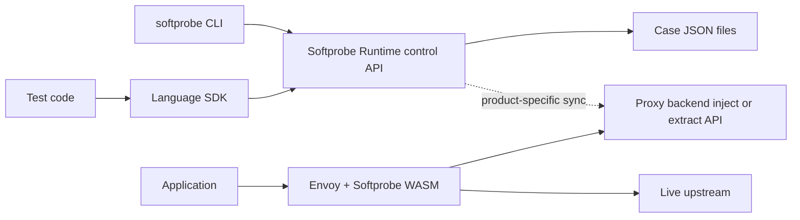

# Softprobe Platform Architecture

This document is the canonical shared architecture for the Softprobe platform.

Related docs:
- [Hybrid platform design](./design.md)
- [Repo layout](./repo-layout.md)
- [Migration plan](./migration-plan.md)
- [HTTP control API](../spec/protocol/http-control-api.md)
- [Proxy OTEL API](../spec/protocol/proxy-otel-api.md)
- [Session headers](../spec/protocol/session-headers.md)

---

## 1) Background

Softprobe combines two main capabilities:

- transparent HTTP interception through proxy technology
- deterministic dependency replay and injection for testing

The platform must scale beyond JavaScript to Python and Java. Therefore, the architecture must be defined independently of any single language implementation.

---

## 2) Architecture principles

- proxy-first for HTTP capture and replay
- shared contracts defined outside any language repo
- one control-plane model for sessions, rules, cases, and decisions
- language-specific SDKs provide ergonomics, not divergent semantics
- optional deep instrumentation stays outside the default product path
- **CLI-first product surface:** one canonical **`softprobe`** command-line tool is the **primary** interface for humans, CI, and automation; it **calls** the [HTTP control API](../spec/protocol/http-control-api.md) on the **Softprobe Runtime** (see [section 10](#10-softprobe-runtime-implementation-and-deployment)). Language repos focus on **libraries** and test integrations, not competing CLIs (see [repo layout](./repo-layout.md)).

---

## 3) Top-level components

### `spec`

Owns:

- case schema
- rule schema
- session model
- decision protocol
- header protocol
- compatibility fixtures

### `softprobe-proxy`

Owns:

- Envoy/WASM data plane
- HTTP interception
- normalization
- OTLP trace **client** calls to the **proxy backend** (`/v1/inject`, `/v1/traces` per [proxy-otel-api.md](../spec/protocol/proxy-otel-api.md)) — **not** to the JSON control runtime (see below)
- enforcement of inject/passthrough/error outcomes
- async extraction of observed exchanges

### `softprobe-runtime` (control API service)

The **Softprobe Runtime** is the **network service** that implements **only** the [HTTP control API](../spec/protocol/http-control-api.md) (JSON) for CLI, SDKs, and automation: sessions, `load-case`, rules, policy, fixtures, close.

It **does not** implement [proxy-otel-api.md](../spec/protocol/proxy-otel-api.md) in the reference OSS layout. Envoy/WASM calls a **separate proxy backend** (hosted example: `https://o.softprobe.ai`) for inject and OTLP collector-style extract.

It is **not** specified as a Kubernetes DaemonSet, Operator, or second mesh control plane. It is a **normal HTTP API service** (see [section 10](#10-softprobe-runtime-implementation-and-deployment)).

### Proxy backend (inject / extract service)

The **proxy backend** implements [proxy-otel-api.md](../spec/protocol/proxy-otel-api.md) for the mesh data plane. It may be **hosted** (production default in many deployments: **`https://o.softprobe.ai`**) or self-hosted for air-gapped environments; the contract is the same. The hosted service exposes standard OTLP collector ingestion endpoints and a Softprobe-specific **`POST /v1/inject`** endpoint on the same OTLP trace schema. **Wasm plugin / proxy config** sets this base URL (for example `sp_backend_url`), independent of **`SOFTPROBE_RUNTIME_URL`** (or equivalent) for the control API.

**Session and case data** used at inject time must stay **consistent** with what tests register via the control API; the exact **sync or unified storage** mechanism is **product integration** (see `docs/design.md` open questions). The open-source `softprobe-runtime` does not need to terminate protobuf inject traffic.

### Language repos

Examples:

- `softprobe-js`
- `softprobe-python`
- `softprobe-java`

Each language repo owns:

- test SDK (session, headers, optional fixtures helpers)
- **optional** thin launcher shims only (for example `npx` / wrapper that invokes the canonical **`softprobe` binary**)
- code generation for that language
- runtime **client** (HTTP control API), and optionally a **local runtime implementation**

The **canonical `softprobe` CLI** is **language-agnostic** (HTTP to the **control** runtime only). Its source may live in a **dedicated small repo**, in **`softprobe-runtime`**, or alongside a temporary reference runtime; it must **not** fork into per-language command vocabularies for the same operations.

---

## 4) Control plane and data plane split

The most important platform boundary is:

- proxy is the HTTP data plane
- **control runtime** exposes the session/case **control API** to tests and tooling
- **proxy backend** performs **inject/extract** and replay decisions for mesh traffic

The proxy must remain simple. It should not embed the full rule engine; it **delegates** inject/extract to the **proxy backend** over [proxy-otel-api.md](../spec/protocol/proxy-otel-api.md).

Tests may use **either** the canonical CLI (typical for scripts and agents) **or** a language SDK; both talk to the **same** HTTP control API on the **control runtime**. The application under test does not call either service directly; it sends traffic through the **proxy**, which calls the **proxy backend** using the [Proxy OTEL API](../spec/protocol/proxy-otel-api.md) (HTTP with OTLP `TracesData` payloads in protobuf or JSON). The JSON control API is **not** used on the proxy request path.

---

### 4.1 Control plane boundary with Istio

Softprobe runs under Istio, so there are two control planes touching the same proxy at different layers.

That is acceptable only if the ownership boundary is explicit:

- Istio owns proxy configuration
- Softprobe owns request-time decisions inside the Softprobe extension

Istio control-plane responsibilities:

- proxy lifecycle
- xDS and filter-chain configuration
- routing
- workload attachment
- security and mTLS policy
- static WASM plugin configuration

Softprobe responsibilities (split by service):

- **Control runtime:** test sessions, case loading via control API, policy and rules as **data** for orchestration; optional tooling (inspect, export) that uses the same session model.
- **Proxy backend:** request-path **inject** resolution, async **extract** handling, and replay/match semantics for traffic seen by the mesh (per [proxy-otel-api.md](../spec/protocol/proxy-otel-api.md)).

Softprobe must not mutate Envoy topology or compete with Istio for routing authority. The **proxy backend** answers inject/extract for the WASM extension; it is **not** a second Istio control plane for routing or xDS.

---

## 5) Core shared concepts

The following concepts must be stable across all languages:

- `case`
- `session`
- `rule`
- `policy`
- `fixture`
- `decision`

These concepts are part of the product contract, not implementation details.

---

## 6) Case model

A case is one JSON artifact for one test scenario. It may contain:

- metadata
- one or more OTEL-compatible traces
- stored rules
- fixtures

The case file is the primary developer replay artifact.

---

## 7) Session model

A session is one active test control scope. Sessions allow test code to control proxy behavior indirectly.

Session state includes:

- session id
- case id
- mode
- rules
- policy
- optional fixtures

The session id is propagated on requests so proxy lookups can be resolved against the correct test context.

---

## 8) Rule model

Rules are the primary dependency injection mechanism. Rules match on normalized HTTP identity and control what data the runtime should return to the proxy and what traffic should be extracted.

The proxy code shows two different concerns:

1. forwarding decision
2. extraction policy

Those must stay separate in the shared model.

### 8.1 Request-path lookup behavior

The proxy-facing wire contract is not a JSON decision envelope.

For `/v1/inject`, the current proxy design is:

- request body: OTEL protobuf `TracesData` with `sp.span.type = "inject"`
- `200` + OTEL protobuf response carrying `http.response.*` attributes => inject returned data
- `404` => miss, passthrough upstream
- other non-success responses => error/failure path

### 8.2 Extraction policy

- `extract`
- `skip`

`extract` is not a forwarding decision. It is a side-effect policy used when Softprobe persists or exports observed HTTP exchanges.

This matches the proxy implementation:

- injection lookup happens on the request path before upstream forwarding
- extraction save happens asynchronously on the response path for non-injected traffic

So the canonical model should be:

- **Proxy → proxy backend** wire protocol:
  - `/v1/inject` using OTLP trace payloads and `200`/`404` semantics
  - `/v1/traces` using OTLP collector ingestion for extraction uploads
- **Tests / CLI → control runtime** use JSON ([http-control-api.md](../spec/protocol/http-control-api.md)) for ergonomics.

Rule precedence for **inject** must be deterministic and shared between the proxy backend and whatever consumes control API updates (implementation detail of the hosted stack or sync layer).

---

## 9) Modes

### `capture`

- capture HTTP traffic
- write case data
- optionally export to OTEL-compatible backend

### `replay`

- resolve HTTP decisions from rules and recordings
- block unmatched traffic in strict mode unless policy allows it

### `generate`

- generate test code from case files using the same public API

---

## 10) Softprobe Runtime: implementation and deployment

The **contracts** (`spec/protocol/*.md`, `spec/schemas/*.json`) define **behavior and wire formats**.

### 10.1 Responsibilities

| Surface | Protocol | Typical implementer |
|---------|----------|---------------------|
| Session, case, rules, policy, fixtures, close | [HTTP control API](../spec/protocol/http-control-api.md) (JSON) | **`softprobe-runtime`** (OSS / self-hosted) |
| Inject lookup, extract upload | [Proxy OTEL API](../spec/protocol/proxy-otel-api.md) (OTLP traces) | **Proxy backend** (e.g. **`https://o.softprobe.ai`**) |

These are **different base URLs** in production: proxy Wasm config points at the **proxy backend**; CLI and SDKs point at the **control runtime**.

### 10.2 Datastore

- **Control runtime (`softprobe-runtime`):** For v1, **in-process memory** is sufficient for session state and parsed case payloads loaded via `load-case`. **No database is required** for the reference OSS service. Add a datastore (for example Redis or PostgreSQL) only if you need **multi-replica HA**, **survive restarts**, or **audit** — document that as a deployment profile when introduced.
- **Proxy backend:** May use any internal storage; **opaque** to the open contracts. Consistency with control API registrations is a **product** concern (see `docs/design.md` open questions).

### 10.3 Implementation language (control runtime)

**Recommended** for **`softprobe-runtime`** and the canonical CLI: **Go** or **Rust** (HTTP JSON server + static CLI binary). **Node** is acceptable short-term inside `softprobe-js` until extraction.

The control runtime **does not** need to parse protobuf inject requests **as a server** unless you later add an optional colocated mode; the default architecture keeps protobuf **only on the proxy backend**.

### 10.4 Binaries and packaging

- **`softprobe` CLI:** HTTP client to the **control** runtime only.
- **Control runtime server:** JSON routes only per [http-control-api.md](../spec/protocol/http-control-api.md).

### 10.5 Kubernetes (informative)

- **`softprobe-runtime`:** `Deployment` + `Service` for the **control API**; tests and CI reach it via DNS or port-forward.
- **Proxy backend:** Usually **external** URL (`https://o.softprobe.ai`) or a **separate** in-cluster `Deployment` if self-hosting that stack.
- **`softprobe-proxy`:** Wasm plugin **`sp_backend_url`** (or equivalent) = **proxy backend** base URL, **not** the control runtime URL.

HA and multi-tenant isolation apply **independently** to each service.

---

## 11) Migration and extraction

Short term:

- keep or introduce a **reference control runtime** (Node in `softprobe-js` **or** new Go/Rust `softprobe-runtime`); **spec** remains the source of truth for contracts.
- move shared truth into `spec` (ongoing).

Long term:

- all language SDKs consume the **same versioned** control API contracts; proxy consumes **proxy-otel-api** against the **proxy backend**.
- **`softprobe-runtime`** is the **home for the OSS control API server** and CLI; **inject/extract** remain the responsibility of the **proxy backend** product unless an optional self-hosted bundle is documented separately.
