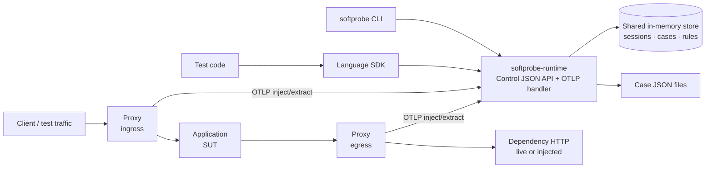

# Softprobe Platform Architecture

This document is the canonical shared architecture for the Softprobe platform.

Related docs:
- [Hybrid platform design](./design.md)
- [Repo layout](./repo-layout.md)
- [Migration plan](./migration-plan.md)
- [HTTP control API](../spec/protocol/http-control-api.md)
- [Proxy OTEL API](../spec/protocol/proxy-otel-api.md)
- [Session headers](../spec/protocol/session-headers.md)

---

## 1) Background

Softprobe combines two main capabilities:

- transparent HTTP interception through proxy technology
- deterministic dependency replay and injection for testing

The platform must scale beyond JavaScript to Python and Java. Therefore, the architecture must be defined independently of any single language implementation.

---

## 2) Architecture principles

- proxy-first for HTTP capture and replay
- shared contracts defined outside any language repo
- one control-plane model for sessions, rules, cases, and decisions
- language-specific SDKs provide ergonomics, not divergent semantics
- optional deep instrumentation stays outside the default product path
- **CLI-first product surface:** one canonical **`softprobe`** command-line tool is the **primary** interface for humans, CI, and automation; it **calls** the [HTTP control API](../spec/protocol/http-control-api.md) on the **Softprobe Runtime** (see [section 10](#10-softprobe-runtime-implementation-and-deployment)). Language repos focus on **libraries** and test integrations, not competing CLIs (see [repo layout](./repo-layout.md)).

---

## 3) Top-level components

### `spec`

Owns:

- case schema
- rule schema
- session model
- decision protocol
- header protocol
- compatibility fixtures

### `softprobe-proxy`

Owns:

- Envoy/WASM data plane
- HTTP interception
- normalization
- OTLP trace **client** calls to **`softprobe-runtime`** (`/v1/inject`, `/v1/traces` per [proxy-otel-api.md](../spec/protocol/proxy-otel-api.md)) — **not** to the JSON control API (see below)
- enforcement of inject/passthrough/error outcomes
- async extraction of observed exchanges

### `softprobe-runtime` (unified service)

The **Softprobe Runtime** is the **network service** that implements **both**:

- The [HTTP control API](../spec/protocol/http-control-api.md) (JSON) for CLI, SDKs, and automation: sessions, `load-case`, rules, policy, fixtures, close.
- The [Proxy OTLP API](../spec/protocol/proxy-otel-api.md): `POST /v1/inject` and `POST /v1/traces` for the Envoy/WASM data plane.

Both handler groups share a **single in-memory session store** (`internal/store/`). When a test calls `load-case` or `rules`, the inject handler immediately sees the updated state — no sync or external backend needed.

For local and self-hosted setups, `SOFTPROBE_RUNTIME_URL` (CLI/SDK config) and `sp_backend_url` (proxy WASM config) both point to the **same** `softprobe-runtime` base URL. The hosted service (`https://o.softprobe.ai`) is the same unified service with durable storage behind it.

It is **not** specified as a Kubernetes DaemonSet, Operator, or second mesh control plane. It is a **normal HTTP API service** (see [section 10](#10-softprobe-runtime-implementation-and-deployment)).

### Language repos

Examples:

- `softprobe-js`
- `softprobe-python`
- `softprobe-java`

Each language repo owns:

- test SDK (session, headers, optional fixtures helpers)
- **optional** thin launcher shims only (for example `npx` / wrapper that invokes the canonical **`softprobe` binary**)
- code generation for that language
- runtime **client** (HTTP control API), and optionally a **local runtime implementation**

The **canonical `softprobe` CLI** is **language-agnostic** (HTTP to the **control** runtime only). Its source may live in a **dedicated small repo**, in **`softprobe-runtime`**, or alongside a temporary reference runtime; it must **not** fork into per-language command vocabularies for the same operations.

---

## 4) Control plane and data plane split

The most important platform boundary is:

- proxy is the HTTP data plane
- **`softprobe-runtime`** serves **both** the session/case control API (for tests and tooling) **and** the inject/extract OTLP handler (for the mesh data plane), from one process with a shared session store

The proxy must remain simple. It should not embed the full rule engine; it **delegates** inject/extract to **`softprobe-runtime`** over [proxy-otel-api.md](../spec/protocol/proxy-otel-api.md).

**What we capture and replay:** the **application’s inbound HTTP** (client → proxy → app) and the **app’s outbound HTTP to dependencies** (app → proxy → upstream), including **requests and responses** on **both** legs. The **Envoy + WASM** path is **not** the system under test—it is the **dual interception point** (ingress + egress) where exchanges are **recorded** (extract), **short-circuited** (inject / replay from case), or **blocked** (policy) without rewriting app code.

In a real mesh, **P1** and **P2** are the **same sidecar**; the diagram shows two edges to stress **two interception directions**. Local **`e2e/`** uses **two listeners** on one Envoy to model that without iptables redirection.

Tests may use **either** the canonical CLI (typical for scripts and agents) **or** a language SDK; both talk to the **same** HTTP control API on **`softprobe-runtime`**. The application under test does not call either service directly; it sends traffic through the **proxy**, which calls **`softprobe-runtime`** OTLP endpoints using the [Proxy OTEL API](../spec/protocol/proxy-otel-api.md) (HTTP with OTLP `TracesData` payloads in protobuf or JSON). The JSON control API is **not** used on the proxy request path.

**Propagation:** Callers (tests) send **`x-softprobe-session-id`** on **ingress**. The **Softprobe WASM** extension injects **W3C Trace Context** on forwarded requests. **Application outbound** calls should use **OpenTelemetry** propagators (**TraceContext**, **Baggage** as needed)—not ad-hoc copying of the session header—so the same trace context (including session data in `tracestate` per proxy behavior) reaches dependencies. See [session-headers.md](../spec/protocol/session-headers.md) and `softprobe-proxy` (`inject_trace_context_headers`, `build_new_tracestate`).

---

### 4.1 Control plane boundary with Istio

Softprobe runs under Istio, so there are two control planes touching the same proxy at different layers.

That is acceptable only if the ownership boundary is explicit:

- Istio owns proxy configuration
- Softprobe owns request-time decisions inside the Softprobe extension

Istio control-plane responsibilities:

- proxy lifecycle
- xDS and filter-chain configuration
- routing
- workload attachment
- security and mTLS policy
- static WASM plugin configuration

Softprobe responsibilities (split by service):

- **Control runtime:** test sessions, case loading via control API, policy and rules as **data** for orchestration; optional tooling (inspect, export) that uses the same session model.
- **`softprobe-runtime` (OTLP handler):** request-path **inject** resolution, async **extract** handling, and replay/match semantics for traffic seen by the mesh (per [proxy-otel-api.md](../spec/protocol/proxy-otel-api.md)).

Softprobe must not mutate Envoy topology or compete with Istio for routing authority. The **`softprobe-runtime` OTLP handler** answers inject/extract for the WASM extension; it is **not** a second Istio control plane for routing or xDS.

---

## 5) Core shared concepts

The following concepts must be stable across all languages:

- `case`
- `session`
- `rule`
- `policy`
- `fixture`
- `decision`

These concepts are part of the product contract, not implementation details.

---

## 6) Case model

A case is one JSON artifact for one test scenario. It may contain:

- metadata
- one or more OTEL-compatible traces
- stored rules
- fixtures

The case file is the primary developer replay artifact.

---

## 7) Session model

A session is one active test control scope. Sessions allow test code to control proxy behavior indirectly.

Session state includes:

- session id
- case id
- mode
- rules
- policy
- optional fixtures

The session id is propagated on requests so proxy lookups can be resolved against the correct test context.

---

## 8) Rule model

Rules are the primary dependency injection mechanism. Rules match on normalized HTTP identity and control what data the runtime should return to the proxy and what traffic should be extracted.

The proxy code shows two different concerns:

1. forwarding decision
2. extraction policy

Those must stay separate in the shared model.

### 8.1 Request-path lookup behavior

The proxy-facing wire contract is not a JSON decision envelope.

For `/v1/inject`, the current proxy design is:

- request body: OTEL protobuf `TracesData` with `sp.span.type = "inject"`
- `200` + OTEL protobuf response carrying `http.response.*` attributes => inject returned data
- `404` => miss, passthrough upstream
- other non-success responses => error/failure path

### 8.2 Extraction policy

- `extract`
- `skip`

`extract` is not a forwarding decision. It is a side-effect policy used when Softprobe persists or exports observed HTTP exchanges.

This matches the proxy implementation:

- injection lookup happens on the request path before upstream forwarding
- extraction save happens asynchronously on the response path for non-injected traffic

So the canonical model should be:

- **Proxy → `softprobe-runtime`** wire protocol:
  - `/v1/inject` using OTLP trace payloads and `200`/`404` semantics
  - `/v1/traces` using OTLP collector ingestion for extraction uploads
- **Tests / CLI → `softprobe-runtime`** use JSON ([http-control-api.md](../spec/protocol/http-control-api.md)) for ergonomics.

Rule precedence for **inject** is deterministic and comes directly from the shared in-memory store — no sync layer needed.

---

## 9) Modes

### `capture`

- capture HTTP traffic
- write case data
- optionally export to OTEL-compatible backend

### `replay`

- resolve HTTP decisions from rules and recordings
- block unmatched traffic in strict mode unless policy allows it

### `generate`

- generate test code from case files using the same public API

---

## 10) Softprobe Runtime: implementation and deployment

The **contracts** (`spec/protocol/*.md`, `spec/schemas/*.json`) define **behavior and wire formats**.

### 10.1 Responsibilities

| Surface | Protocol | Implementer |
|---------|----------|-------------|
| Session, case, rules, policy, fixtures, close | [HTTP control API](../spec/protocol/http-control-api.md) (JSON) | **`softprobe-runtime`** (unified OSS service) |
| Inject lookup, extract upload | [Proxy OTEL API](../spec/protocol/proxy-otel-api.md) (OTLP traces) | **`softprobe-runtime`** (same service; `sp_backend_url` = `SOFTPROBE_RUNTIME_URL`) |

For local and self-hosted deployments, `SOFTPROBE_RUNTIME_URL` (CLI/SDK) and `sp_backend_url` (proxy WASM config) point to the **same** `softprobe-runtime` base URL.

### 10.2 Datastore

For v1, **in-process memory** is sufficient for all session state, loaded cases, rules, and policy. **No database is required** for the reference OSS service. Both the control API handler and the OTLP inject handler share the same `internal/store/` in-memory store — no sync needed. Add a datastore (for example Redis or PostgreSQL) only if you need **multi-replica HA**, **survive restarts**, or **audit** — document that as a deployment profile when introduced.

### 10.3 Implementation language

**`softprobe-runtime`** and the canonical CLI: **Go** (HTTP JSON server + OTLP handler + static CLI binary).

The runtime accepts OTLP JSON payloads for `/v1/inject` and `/v1/traces`. Protobuf support can be added later if proxy volume demands it; JSON OTLP is sufficient for v1.

### 10.4 Binaries and packaging

- **`softprobe` CLI:** HTTP client to the **control** API on `softprobe-runtime` only.
- **`softprobe-runtime` server:** JSON control routes + OTLP inject/extract routes from one binary.

### 10.5 Kubernetes (informative)

- **`softprobe-runtime`:** Single `Deployment` + `Service`; tests, CLI, and proxy WASM all reach it via DNS or port-forward.
- **`softprobe-proxy`:** Wasm plugin `sp_backend_url` = **`softprobe-runtime`** service URL (same as `SOFTPROBE_RUNTIME_URL`).

HA and scaling apply to the single `softprobe-runtime` service. A future multi-process split (separate inject/extract scale-out) is an explicit non-goal for v1.

---

## 11) Migration and extraction

Short term:

- keep or introduce a **reference control runtime** (Node in `softprobe-js` **or** new Go/Rust `softprobe-runtime`); **spec** remains the source of truth for contracts.
- move shared truth into `spec` (ongoing).

Long term:

- all language SDKs consume the **same versioned** control API contracts; proxy consumes **proxy-otel-api** against **`softprobe-runtime`**.
- **`softprobe-runtime`** is the **home for the OSS unified server** (control API + OTLP inject/extract) and CLI. A separate inject/extract scale-out service is a future option documented when HA requirements arise.
