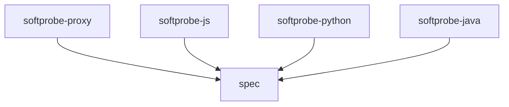

# Softprobe Multi-Repo and Package Layout

This document defines the recommended repository strategy and package/module boundaries for the Softprobe platform as it expands beyond JavaScript into Python and Java.

Transition note:
- canonical repo-topology guidance now belongs in `../spec/`
- this file remains a transition copy inside `softprobe-js` so current repo docs stay connected during migration

Status:
- proposed target layout
- intended to guide repo creation, ownership, and task decomposition
- intended to prevent language-specific behavior from becoming the de facto spec

Related docs:
- [Main design](./design.md)
- [Proxy-first capture and injection design](./design-proxy-first.md)
- [Context design](./design-context.md)
- [Matcher design](./design-matcher.md)

---

## 1) Background

Softprobe currently exists as two repos:

- `softprobe-js`
- `proxy`

That was reasonable when the system was primarily a JavaScript implementation plus a proxy implementation. It becomes a problem once Python and Java are added.

Without a language-neutral contract repo, one implementation will silently become the source of truth. In practice that would likely be `softprobe-js`, which creates several risks:

- Python and Java teams reverse-engineer JS behavior instead of implementing an explicit contract
- the proxy integrates with one language runtime first and others later
- case-file format, decision protocol, and rule semantics drift across languages
- generated test behavior becomes inconsistent

The layout must therefore separate:

- platform contracts
- HTTP data-plane implementation
- language-specific SDKs and generators

---

## 2) Goals

- Define a repo strategy that scales to JavaScript, Python, and Java.
- Keep HTTP interception and replay policy clearly separated.
- Make cross-language behavior contract-first, not implementation-first.
- Minimize duplicated logic while allowing language-native developer ergonomics.
- Make ownership and release boundaries clear.

---

## 3) Non-goals

- Do not force all code into one monorepo.
- Do not make the proxy repo responsible for language SDK logic.
- Do not centralize all runtime logic inside `softprobe-js` forever.
- Do not create per-language variants of the core rule model or case schema.

---

## 4) Recommended top-level repo strategy

Create and maintain five repos:

1. `spec`
2. `softprobe-proxy`
3. `softprobe-js`
4. `softprobe-python`
5. `softprobe-java`

This is the recommended long-term layout.

### 4.1 Repo purposes

#### `spec`

Owns the shared contracts:

- case-file JSON schema
- OTEL compatibility mapping rules
- HTTP decision protocol between proxy and runtime
- session header definitions
- rule DSL schema
- compatibility test vectors
- versioning policy for shared contracts

#### `softprobe-proxy`

Owns the HTTP data plane:

- Envoy/WASM extension
- request/response normalization
- session header propagation
- runtime decision lookup client
- capture/export plumbing
- proxy-level integration tests

#### `softprobe-js`

Owns JavaScript ergonomics and implementation:

- Node test SDK
- JavaScript CLI
- local runtime implementation or runtime client
- JavaScript/Vitest/Jest test generation
- optional JS-specific instrumentation packages

#### `softprobe-python`

Owns Python ergonomics and implementation:

- Python test SDK
- Python CLI wrapper if needed
- local runtime implementation or runtime client
- Pytest integration
- Python test generation

#### `softprobe-java`

Owns Java ergonomics and implementation:

- Java SDK
- JUnit integration
- runtime client
- Java test generation

---

## 5) Repo dependency rules

Dependency direction must remain strict:

- language repos depend on `spec`
- `softprobe-proxy` depends on `spec`
- `softprobe-proxy` must not depend on `softprobe-js`, `softprobe-python`, or `softprobe-java`
- language repos must not depend on each other
- `spec` must not depend on any language repo

Allowed dependency graph:



Disallowed:

- `softprobe-python -> softprobe-js`
- `softprobe-java -> softprobe-js`
- `softprobe-proxy -> softprobe-js`
- `spec -> softprobe-js`

---

## 6) `spec` layout

This repo is the shared contract authority. It should be small, stable, and heavily tested.

Recommended layout:

```text
spec/
  README.md
  docs/
    versioning.md
    compatibility-policy.md
    migration-policy.md
  schemas/
    case.schema.json
    rule.schema.json
    decision-request.schema.json
    decision-response.schema.json
    session.schema.json
  otel/
    attribute-conventions.md
    trace-mapping.md
  protocol/
    http-control-api.md
    session-headers.md
    error-model.md
  examples/
    cases/
    rules/
    decisions/
  compatibility-tests/
    fixtures/
    expected/
  changelog/
```

### 6.1 What belongs in `spec`

- JSON Schemas
- OpenAPI spec for runtime control APIs
- example requests and responses
- normative matching and precedence rules
- golden test fixtures that all implementations must pass

### 6.2 What must not live in `spec`

- production runtime code
- proxy implementation code
- language-specific code generation templates
- framework-specific examples tied to one language

---

## 7) `softprobe-proxy` layout

This repo owns the proxy data plane only.

Recommended layout:

```text
softprobe-proxy/
  README.md
  docs/
    architecture.md
    deployment.md
    local-dev.md
  src/
    config/
    headers/
    normalize/
    capture/
    decision_client/
    enforce/
    export/
    wasm/
  proto/
  deploy/
  test/
    envoy/
    integration/
    fixtures/
  examples/
```

### 7.1 Module boundaries inside `softprobe-proxy`

- `config/`
  - parse plugin config
  - validate runtime endpoint settings
  - validate propagation settings

- `headers/`
  - extract `x-softprobe-session-id`
  - propagate supported Softprobe headers
  - normalize header casing and filtering

- `normalize/`
  - map raw Envoy request/response state into canonical HTTP identity
  - no rule evaluation here

- `capture/`
  - body buffering
  - response capture
  - event emission toward runtime/export sink

- `decision_client/`
  - request runtime decisions
  - handle timeout/retry/error mapping

- `enforce/`
  - apply `MOCK`, `PASSTHROUGH`, `RECORD`, `ERROR`
  - no matching logic here

- `export/`
  - OTEL export or event forwarding
  - no replay logic here

### 7.2 Proxy acceptance boundary

If the runtime decision API changes, `softprobe-proxy` should only need client adaptation. It should never need rule-engine changes, session-policy changes, or code-generator changes.

---

## 8) `softprobe-js` layout

This repo owns the JavaScript operator experience and one reference implementation of the runtime behavior.

Recommended layout:

```text
softprobe-js/
  README.md
  docs/
  src/
    sdk/
      session/
      rules/
      fixtures/
      clients/
    runtime/
      sessions/
      cases/
      rules/
      matcher/
      decision_api/
      storage/
    cli/
      case/
      session/
      rule/
      generate/
    generate/
      common/
      vitest/
      jest/
    optional-hooks/
      http/
      db/
  examples/
  tests/
```

### 8.1 Module responsibilities

- `sdk/`
  - public JS API for test authors
  - session lifecycle helpers
  - session-aware HTTP client helpers

- `runtime/`
  - reference implementation of:
    - case loading
    - rule evaluation
    - session state
    - decision endpoint
  - may later be extracted into a standalone runtime repo if needed

- `cli/`
  - automation surface for humans and AI agents
  - should map closely to runtime concepts

- `generate/`
  - JS test generation only
  - common generation planning can be shared internally, but emitted templates stay JS-specific

- `optional-hooks/`
  - advanced instrumentation packages
  - must not be a hard dependency of core replay

### 8.2 What `softprobe-js` should not own

- canonical spec documents
- proxy runtime client for all languages
- Java/Python templates
- cross-language acceptance tests as the sole source of truth

---

## 9) `softprobe-python` layout

Python should mirror the same product concepts, but with Python-native packaging and APIs.

Recommended layout:

```text
softprobe-python/
  README.md
  pyproject.toml
  softprobe/
    sdk/
      session.py
      rules.py
      fixtures.py
      client.py
    runtime_client/
      sessions.py
      decisions.py
      cases.py
    cli/
      main.py
      case.py
      session.py
      rule.py
      generate.py
    generate/
      pytest/
      common/
  tests/
    unit/
    integration/
```

### 9.1 Python boundary recommendation

For Python v1, prefer a runtime client over a full embedded runtime unless there is a strong local-only requirement. That reduces duplicated core logic early.

Recommended v1 posture:

- SDK + CLI + generator in Python
- runtime accessed through the shared control API
- embed a local runtime later only if developer experience requires it

---

## 10) `softprobe-java` layout

Java should also align to the shared model, while keeping Java packaging and testing idioms.

Recommended layout:

```text
softprobe-java/
  README.md
  build.gradle.kts
  settings.gradle.kts
  softprobe-sdk/
    src/main/java/
    src/test/java/
  softprobe-junit/
    src/main/java/
    src/test/java/
  softprobe-runtime-client/
    src/main/java/
    src/test/java/
  softprobe-generator/
    src/main/java/
    src/test/java/
```

### 10.1 Java boundary recommendation

For Java v1, use a runtime client plus JUnit integration. Do not build a separate Java rule engine before the shared runtime protocol has stabilized.

---

## 11) Shared package strategy inside language repos

The same conceptual split should exist across JS, Python, and Java:

1. `sdk`
2. `runtime_client` or `runtime`
3. `cli`
4. `generate`
5. optional advanced integrations

This keeps user concepts stable across languages even when implementation details differ.

### 11.1 Stable cross-language public concepts

Every language should expose the same core nouns:

- `session`
- `case`
- `rule`
- `policy`
- `fixture`
- `generate`

That consistency matters for:

- documentation
- AI agent usage
- multi-language teams
- support and debugging

---

## 12) Runtime placement strategy

There are two viable runtime deployment models:

### Model A: embedded runtime in `softprobe-js`

Pros:

- fastest path from current state
- easiest for local JS-driven development

Cons:

- Python and Java become second-class if they must rely on JS process semantics
- harder to claim language-neutral architecture

### Model B: standalone runtime repo later

Pros:

- clean platform boundary
- equal treatment for JS, Python, and Java

Cons:

- more upfront packaging and deployment work

### Recommendation

Use a staged strategy:

1. short term: keep the reference runtime in `softprobe-js`
2. medium term: stabilize the protocol in `spec`
3. later: extract a standalone `softprobe-runtime` repo only when multiple language clients are active and the API has settled

This avoids premature platform extraction while still keeping the architecture clean.

---

## 13) Versioning strategy

### 13.1 Spec versioning

`spec` should own semantic versions for:

- case schema
- rule schema
- decision API
- header protocol

### 13.2 Implementation compatibility

Each implementation repo should declare:

- supported spec version range
- supported proxy/runtime protocol version range

Example:

```text
softprobe-proxy 1.4.0 supports spec 1.x
softprobe-js 3.2.0 supports spec 1.x
softprobe-python 0.8.0 supports spec 1.x
softprobe-java 0.6.0 supports spec 1.x
```

### 13.3 Compatibility tests

The compatibility fixtures in `spec` should be run in CI by every implementation repo.

---

## 14) Ownership model

Recommended ownership:

- `spec`
  - architecture/platform owners
- `softprobe-proxy`
  - systems or networking owners
- `softprobe-js`
  - JavaScript/Node owners
- `softprobe-python`
  - Python owners
- `softprobe-java`
  - Java owners

Cross-repo changes that alter protocol or schema must start in `spec`.

---

## 15) Release workflow

Recommended release order for shared-contract changes:

1. update `spec`
2. release contract artifacts
3. update `softprobe-proxy`
4. update language repos
5. run compatibility CI against the new spec version

This order prevents silent drift.

---

## 16) Migration plan from current state

### Phase 1: normalize names

- treat `proxy` as `softprobe-proxy` conceptually
- keep `softprobe-js` as-is
- add multi-repo and proxy-first RFCs

### Phase 2: create `spec`

- extract from current docs the shared pieces:
  - case schema
  - rule schema
  - decision protocol
  - session headers
  - compatibility examples

### Phase 3: bind current repos to the spec

- make `softprobe-js` consume `spec`
- make `softprobe-proxy` consume `spec`
- add compatibility CI in both repos

### Phase 4: add new language repos

- create `softprobe-python` as SDK + runtime client + generator
- create `softprobe-java` as SDK + JUnit + runtime client + generator

### Phase 5: evaluate runtime extraction

- if multi-language usage is real and the control API is stable, extract `softprobe-runtime`

---

## 17) Acceptance criteria

- A new engineer can identify which repo owns protocol, proxy behavior, and each language SDK without ambiguity.
- The case-file format and rule model are defined outside `softprobe-js`.
- `softprobe-proxy` has no dependency on any language repo.
- Python and Java repos can be built without copying JS internals.
- Every implementation repo can run the same shared compatibility fixtures.
- The public concepts `session`, `case`, `rule`, `policy`, and `generate` exist consistently across languages.

---

## 18) Final recommendation

Adopt a contract-first platform layout:

- `spec` for shared truth
- `softprobe-proxy` for HTTP interception
- `softprobe-js`, `softprobe-python`, and `softprobe-java` for language-native operator experience

Keep the runtime implementation in `softprobe-js` temporarily if needed, but do not let `softprobe-js` remain the architectural source of truth. The spec repo must become that source of truth before Python and Java work begins in earnest.
