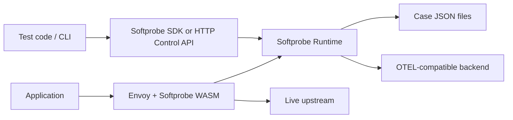

# Softprobe Proxy-First Capture and Injection Design

This document defines the target design for combining `softprobe-js` and `proxy` into one **hybrid** product: **proxy-first** for HTTP (default), **optional** language-level instrumentation for non-HTTP deps and environments without a mesh.

**Canonical platform spec:** [`docs/design.md`](../docs/design.md) (including **§2.5 Instrumentation planes**). **Language-plane roadmap** (NDJSON + YAML as legacy; runtime + case JSON as target): [`docs/language-instrumentation.md`](../docs/language-instrumentation.md). **Proxy vs customer APM (OOB OTLP to Softprobe):** [`docs/proxy-integration-posture.md`](../docs/proxy-integration-posture.md).

Transition note:
- canonical shared architecture is moving to `../spec/` and `../docs/design.md`
- this file remains a repo-local working copy for the JavaScript implementation until the migration is complete

Status:
- proposed architecture for the next major implementation phase
- intended to replace NDJSON-first HTTP replay as the default path
- intended to keep language-level patching optional, not foundational
- NDJSON + cassette layout in [`design-cassette.md`](./design-cassette.md) is a **legacy** implementation slated for removal as part of the Node language-plane cutover to runtime-backed case artifacts

Related docs:
- [Main design](./design.md)
- [Context design](./design-context.md)
- [Matcher design](./design-matcher.md)
- [Cassette design (legacy NDJSON baseline)](./design-cassette.md)

---

## 1) Background

Softprobe currently has two strong but different assets:

- `softprobe-js` already has useful replay semantics, context scoping, and optional dependency mocking.
- `proxy` already provides transparent, high-performance HTTP interception with minimal app changes.

The problem is product economics. Broad language-level patching across Express 4/5, Fastify, `fetch`, Axios, `pg`, Redis, `ioredis`, and future frameworks is expensive to build and expensive to maintain. For a startup, making deep instrumentation the main path creates too much implementation cost and too much compatibility risk.

At the same time, users still need deterministic testing. In particular:

- outbound HTTP dependencies should be mocked by default during tests
- some inbound HTTP interactions should be replayed to reproduce end-to-end flows
- test code must be able to override or inject mocks per test case
- recordings must be usable both for replay and for generated test code
- the system must support local files and OTEL-compatible backends

The combined design therefore pivots to a simpler center of gravity:

- proxy handles HTTP interception
- Softprobe runtime handles policy, matching, storage, and test control
- language-level patching becomes optional

---

## 2) Goals

### 2.1 Product goals

- Make HTTP capture and replay the default product path.
- Require zero or near-zero application code changes for the main value proposition.
- Let users control mocks from normal test frameworks such as Jest, Pytest, and JUnit.
- Support two test modes:
  - `replay`: deterministic dependency injection from recordings plus rules
  - `generate`: test code generation from recordings using the same injection API
- Store each test case as one JSON file containing a list of OTEL-compatible traces.
- Support sink fan-out to both local JSON case files and OTEL-compatible backends.
- Keep DB and non-HTTP dependency injection possible, but optional and explicitly later.

### 2.2 Engineering goals

- Define one canonical HTTP interaction schema.
- Define one decision protocol shared by proxy and future SDK extensions.
- Define one rule model that can be used from APIs, CLI, stored files, and generated tests.
- Keep control-plane APIs small enough for both humans and AI agents to use reliably.

---

## 3) Non-goals

- Do not make Express/Fastify/client-library patching mandatory for v1.
- Do not solve all non-HTTP dependency mocking in the default path.
- Do not make OTLP the source of truth for replay semantics.
- Do not put complex matching logic into the Envoy WASM extension.
- Do not require users to author Envoy config manually for common local test flows.

---

## 4) Design principles

- Proxy-first for HTTP, SDK-optional for everything else.
- One canonical event model, many storage and export sinks.
- Control plane owns decisions; data plane only intercepts and enforces.
- Per-test isolation must be explicit and deterministic.
- Rules must be composable and inspectable.
- Generated tests must use the same public API as handwritten tests.

---

## 5) Terminology

- `case`: one test scenario artifact stored as one JSON file
- `recording`: captured traces and metadata stored in a case file
- `session`: one active test control scope, usually mapped to one test function
- `rule`: a match condition plus action
- `decision`: the result returned to proxy for an intercepted HTTP exchange
- `runtime`: the Softprobe control-plane service that stores sessions, rules, and cases
- `proxy extension`: the Envoy/WASM component that intercepts HTTP traffic

---

## 6) High-level architecture

### 6.1 Component roles

1. `proxy/`

- intercept inbound and outbound HTTP
- normalize HTTP request identity
- buffer request/response data when needed for capture or injection
- attach test/session metadata from headers
- ask Softprobe runtime for a decision
- enforce the returned decision
- emit capture events to sinks

2. `softprobe-runtime` (new logical component; can initially live in `softprobe-js`)

- manage test sessions
- manage rules and rule precedence
- load case files
- match intercepted traffic to recorded interactions
- return injection decisions to proxy
- write case files and export to OTEL-compatible backends

3. `softprobe-js`

- provide CLI
- provide test framework APIs and helpers
- provide generated test code target
- optionally provide future non-HTTP instrumentation packages

4. Future optional packages

- `@softprobe/js-http-hooks`
- `@softprobe/js-db-hooks`
- similar packages for Python or Java if later justified

### 6.2 Architectural split

The key boundary is:

- proxy is the HTTP data plane
- Softprobe runtime is the replay and injection control plane

The proxy extension must not embed the full matcher or rule engine. It should remain simple, fast, and language-agnostic.



---

## 7) Default runtime model

### 7.1 Default product behavior

- Proxy capture is on by default for HTTP when enabled.
- Outbound external HTTP is mocked from recordings by default in replay mode.
- Live outbound calls are blocked in strict replay mode unless a rule allows passthrough.
- Inbound HTTP replay is supported for reproducing higher-level test scenarios.
- Language-level DB mocking is not part of the default path.

### 7.2 Modes

#### `capture`

- proxy captures inbound and outbound HTTP
- runtime persists captured data into the active case
- runtime may also export the same captured data to OTEL-compatible backend

#### `replay`

- proxy asks runtime for every relevant HTTP decision
- runtime returns a request-path result of `HIT`, `MISS`, or `ERROR`, plus an extraction policy of `EXTRACT` or `SKIP`
- runtime may match against case recordings, explicit rules, or both

#### `generate`

- runtime reads existing case files
- generator produces test code that uses the same public injection API
- generated tests may be refined by humans instead of introducing a separate DSL

---

## 8) Storage model

### 8.1 Case file format

Each case is stored as one JSON file. NDJSON is no longer required for the target design.

Recommended layout:

- directory: `.softprobe/cases/`
- file naming: `<suite>/<case-name>.softprobe.json`

Example:

```json
{
  "version": "5.0",
  "caseId": "checkout-happy-path",
  "suite": "payment",
  "mode": "capture",
  "createdAt": "2026-03-19T12:00:00.000Z",
  "source": {
    "service": "checkout-service",
    "environment": "test"
  },
  "tags": {
    "framework": "jest"
  },
  "traces": [
    {
      "resourceSpans": [
        {
          "resource": {
            "attributes": [
              { "key": "service.name", "value": { "stringValue": "checkout-service" } }
            ]
          },
          "scopeSpans": [
            {
              "scope": { "name": "softprobe" },
              "spans": [
                {
                  "traceId": "f4a0...",
                  "spanId": "19ab...",
                  "name": "HTTP GET api.stripe.com/v1/customers",
                  "kind": 3,
                  "startTimeUnixNano": "1742347200000000000",
                  "endTimeUnixNano": "1742347200123000000",
                  "attributes": [
                    { "key": "http.request.method", "value": { "stringValue": "GET" } },
                    { "key": "url.full", "value": { "stringValue": "https://api.stripe.com/v1/customers" } },
                    { "key": "server.address", "value": { "stringValue": "api.stripe.com" } },
                    { "key": "softprobe.direction", "value": { "stringValue": "outbound" } },
                    { "key": "softprobe.case_id", "value": { "stringValue": "checkout-happy-path" } }
                  ],
                  "events": [
                    {
                      "name": "softprobe.http.exchange",
                      "attributes": [
                        { "key": "softprobe.request.headers", "value": { "stringValue": "{\"accept\":\"application/json\"}" } },
                        { "key": "softprobe.request.body", "value": { "stringValue": "" } },
                        { "key": "softprobe.response.status_code", "value": { "intValue": "200" } },
                        { "key": "softprobe.response.headers", "value": { "stringValue": "{\"content-type\":\"application/json\"}" } },
                        { "key": "softprobe.response.body", "value": { "stringValue": "{\"id\":\"cus_123\"}" } }
                      ]
                    }
                  ]
                }
              ]
            }
          ]
        }
      ]
    }
  ],
  "rules": [],
  "fixtures": []
}
```

### 8.2 Storage rules

- one file per case, not one file per trace
- a case file may contain one or more OTEL-compatible traces
- the file may contain both captured traces and hand-authored rules
- local case files are the primary replay artifact for developer workflows
- OTEL-compatible backend is a secondary sink for search, analytics, and centralized storage

### 8.3 Source of truth

For replay semantics, the source of truth is the Softprobe case model, not raw OTLP export. OTEL compatibility is required for interoperability, but replay-specific metadata is carried through Softprobe attributes and events.

---

## 9) Canonical interaction model

The runtime must normalize proxy traffic into one canonical HTTP interaction model before storage or matching.

```ts
export type SoftprobeHttpInteraction = {
  version: '5.0';
  interactionId: string;
  caseId: string;
  traceId: string;
  spanId: string;
  parentSpanId?: string;
  timestamp: string;

  direction: 'inbound' | 'outbound';
  protocol: 'http';

  source: {
    service?: string;
    workload?: string;
    namespace?: string;
  };

  target: {
    scheme?: string;
    host?: string;
    port?: number;
    method: string;
    path: string;
    query?: string;
  };

  request: {
    headers?: Record<string, string>;
    body?: string;
    bodyEncoding?: 'plain' | 'base64';
  };

  response: {
    status: number;
    headers?: Record<string, string>;
    body?: string;
    bodyEncoding?: 'plain' | 'base64';
  };

  tags?: Record<string, string>;
};
```

This normalized shape is the input to matching, rule evaluation, and code generation. Case files may store it either directly or embedded inside OTEL-compatible trace events.

---

## 10) Test control and injection model

### 10.1 Core problem

Users write tests in Jest, Pytest, JUnit, and similar frameworks. They need to control HTTP injection from test code, but the actual HTTP interception happens in Envoy.

The design answer is:

- tests do not talk to Envoy directly
- tests create a Softprobe session
- tests register rules, fixtures, and policies with the runtime
- test requests carry a session identifier
- Envoy forwards the session identifier to the runtime during lookup
- runtime returns the decision for that test session

This keeps the test API stable across languages while letting Envoy remain the enforcement point.

### 10.2 Session lifecycle

Each test function or test case creates a session.

Session state includes:

- `sessionId`
- `caseId`
- `mode`
- rule set
- default policy
- optional loaded recordings
- optional seeded auth/session fixtures

Recommended lifecycle:

1. test starts session
2. test loads case and default rules
3. test optionally registers test-specific overrides
4. test executes application traffic
5. proxy sends intercepted request plus `sessionId` to runtime
6. runtime resolves decision using that session
7. test ends session and optionally verifies unused or unmatched injections

### 10.3 Session propagation

The session id should be propagated through a dedicated header on requests originating from the test environment.

Recommended header:

- `x-softprobe-session-id`

Optional related headers:

- `x-softprobe-mode`
- `x-softprobe-case-id`
- `x-softprobe-test-name`

For inbound replay scenarios, the test harness or generated client should attach these headers when triggering the system under test. For service-to-service propagation inside the mesh, the proxy may propagate `x-softprobe-session-id` automatically when the request already belongs to an active Softprobe-controlled session.

### 10.4 Public API shape

The public API must be available in two forms:

1. language SDKs
2. raw HTTP control API for unsupported languages and AI agents

#### TypeScript example

```ts
import { softprobe } from '@softprobe/testkit';

test('checkout retries after auth refresh', async () => {
  await softprobe.session(async (session) => {
    await session.loadCase('payment/checkout-auth-refresh');
    await session.policy({
      network: 'blocked',
      unmatched: 'error'
    });

    await session.inject.http({
      when: {
        direction: 'outbound',
        host: 'auth.example.com',
        method: 'POST',
        path: '/oauth/token'
      },
      then: {
        action: 'inject',
        source: 'inline',
        response: {
          status: 200,
          headers: { 'content-type': 'application/json' },
          body: { access_token: 'test-token', expires_in: 3600 }
        },
        extract: 'skip'
      }
    });

    const client = session.httpClient();
    const res = await client.post('http://localhost:3000/checkout', {
      items: [{ sku: 'sku_123', qty: 1 }]
    });

    expect(res.status).toBe(200);
    await session.assertNoPendingRules();
  });
});
```

#### Python example

```python
from softprobe import session

def test_checkout_happy_path():
    with session(case="payment/checkout-happy-path", mode="replay") as sp:
        sp.policy(network="blocked", unmatched="error")
        sp.inject_http(
            when={
                "direction": "outbound",
                "host": "api.stripe.com",
                "method": "POST",
                "path": "/v1/payment_intents",
            },
            then={
                "action": "inject",
                "source": "inline",
                "response": {
                    "status": 200,
                    "body": {"id": "pi_123", "status": "succeeded"},
                },
                "extract": "skip",
            },
        )

        response = sp.post("http://localhost:3000/pay", json={"amount": 1000})
        assert response.status_code == 200
        sp.assert_no_pending_rules()
```

#### JUnit example

```java
@Test
void checkoutHappyPath() throws Exception {
  try (SoftprobeSession sp = Softprobe.session("payment/checkout-happy-path", Mode.REPLAY)) {
    sp.policy(NetworkPolicy.BLOCKED, UnmatchedPolicy.ERROR);

    sp.injectHttp(
      Rule.when()
        .direction("outbound")
        .host("inventory.internal")
        .method("GET")
        .path("/stock/sku_123")
        .thenInject(
          HttpResponseSpec.status(200).json("{\"available\":true}")
        )
        .extract("SKIP")
    );

    HttpResponse<String> response = sp.client()
      .post("http://localhost:3000/checkout", "{\"sku\":\"sku_123\"}");

    assertEquals(200, response.statusCode());
    sp.assertNoPendingRules();
  }
}
```

### 10.5 Raw HTTP control API

The runtime must expose a small HTTP API so the same behavior is available without a language SDK.

```http
POST /v1/sessions
POST /v1/sessions/{sessionId}/load-case
POST /v1/sessions/{sessionId}/policy
POST /v1/sessions/{sessionId}/rules
POST /v1/sessions/{sessionId}/fixtures/auth
POST /v1/sessions/{sessionId}/close
POST /v1/decisions/http
```

Example decision request from proxy:

```json
{
  "sessionId": "sp_sess_123",
  "caseId": "payment/checkout-happy-path",
  "mode": "replay",
  "request": {
    "direction": "outbound",
    "method": "POST",
    "scheme": "https",
    "host": "api.stripe.com",
    "path": "/v1/payment_intents",
    "query": "",
    "headers": {
      "content-type": "application/json"
    },
    "body": "{\"amount\":1000}"
  },
  "context": {
    "service": "checkout-service",
    "testName": "checkout happy path"
  }
}
```

Example decision response:

```json
{
  "decision": "MOCK",
  "matchedBy": {
    "kind": "rule",
    "id": "rule_42"
  },
  "response": {
    "status": 200,
    "headers": {
      "content-type": "application/json"
    },
    "body": "{\"id\":\"pi_123\",\"status\":\"succeeded\"}"
  }
}
```

---

## 11) Rule model

### 11.1 Problem statement

A simple `inject add http ...` CLI is not enough. The design needs a rule model that supports:

- exact replay from recordings
- explicit overrides from test code
- fallback policies
- matching based on request attributes, tags, and test metadata
- generated tests using the same primitives

### 11.2 Rule contract

```ts
export type SoftprobeRule = {
  id?: string;
  priority?: number;
  consume?: 'once' | 'many';

  when: {
    direction?: 'inbound' | 'outbound';
    service?: string;
    scheme?: string;
    host?: string | { regex: string };
    method?: string;
    path?: string | { regex: string };
    query?: string | { regex: string };
    headers?: Record<string, string | { regex: string }>;
    body?: {
      jsonPath?: string;
      equals?: unknown;
      regex?: string;
    }[];
    tags?: Record<string, string>;
    testName?: string | { regex: string };
    caseId?: string;
  };

  then:
    | { result: 'hit'; response: HttpResponseSpec; extract?: 'skip' | 'extract' }
    | { result: 'miss'; extract?: 'skip' | 'extract' }
    | { result: 'error'; status?: number; message: string; extract?: 'skip' | 'extract' }
    | { action: 'patch-recording'; patch: ResponsePatchSpec };
};
```

Terminology note:

- proxy should see only `hit`, `miss`, or `error`
- a `hit` means the runtime returned injection data
- whether that data came from a case file, inline fixture, or generated rule is an internal runtime detail
- `extract` is a capture/export policy, not a request-path result

### 11.3 Rule precedence

Rule resolution order must be deterministic:

1. inline test overrides registered in the active session
2. explicit case-level rules stored in the case file
3. replay match against recorded interactions in the loaded case
4. global environment rules
5. session default policy

This precedence is critical because it lets generated tests and handwritten tests share behavior cleanly.

### 11.4 Rule consumption

Rules may be:

- `once`: consumed after first match
- `many`: reusable

This supports assertions such as:

- exactly one token refresh call
- allow unlimited health checks

### 11.5 Rule explainability

The runtime must be able to explain why a request matched or failed to match:

- matched rule id
- matched recording id
- first mismatch reason
- final fallback policy used

This explainability must be available in SDK errors, CLI output, and optional debug logs.

---

## 12) Matching and decision engine

### 12.1 Decision types

```ts
export type SoftprobeDecision =
  | { result: 'HIT'; response: HttpResponseSpec; matchedBy: MatchRef }
  | { result: 'MISS'; matchedBy: MatchRef }
  | { result: 'ERROR'; status: number; message: string; matchedBy?: MatchRef };
```

And separately:

```ts
export type SoftprobeExtractPolicy = 'EXTRACT' | 'SKIP';
```

### 12.2 Matching inputs

Matching should use normalized HTTP identity:

- direction
- service
- scheme
- host
- method
- path
- query
- selected headers
- selected body selectors
- case id
- test name
- tags

### 12.3 Replay matching

Recorded interaction matching should proceed in stages:

1. coarse key: `direction + host + method + path`
2. optional query comparison
3. optional header comparison for configured keys
4. optional body selector comparison
5. deterministic sequence selection among remaining candidates

Sequence selection is necessary for repeated identical calls within one case.

### 12.4 No-match behavior

No-match behavior is not implicit. It must be determined by session policy:

- `unmatched=error`
- `unmatched=passthrough`
- `extract=extract | skip`

Default for replay mode:

- outbound external HTTP: `error`
- explicitly allowed internal calls: `passthrough`

---

## 13) Auth and test fixture model

HTTP replay handles many auth flows already because token exchange and identity-provider calls are HTTP. Some tests still need explicit fixture setup for cookies, headers, or session state.

The design therefore includes a small fixture API in addition to HTTP injection rules.

Example:

```ts
await session.fixture.auth({
  requestHeaders: {
    authorization: 'Bearer test-token'
  },
  cookies: [
    { name: 'sid', value: 'abc123', domain: 'localhost', path: '/' }
  ]
});
```

Fixture scope:

- only affects requests sent through the session client helpers
- does not replace the general HTTP rule engine
- should remain minimal in v1

This is cheaper and more robust than framework patching for auth setup.

---

## 14) CLI design

The CLI must map to the runtime model directly and remain scriptable by humans and AI agents.

### 14.1 Primary commands

```bash
softprobe case capture --case payment/checkout-happy-path -- http://localhost:3000/checkout
softprobe case inspect payment/checkout-happy-path
softprobe case export-otlp payment/checkout-happy-path

softprobe session start --case payment/checkout-happy-path --mode replay
softprobe session policy --session $SOFTPROBE_SESSION_ID --network blocked --unmatched error
softprobe rule add http --session $SOFTPROBE_SESSION_ID --file rules/stripe-success.json
softprobe session close --session $SOFTPROBE_SESSION_ID

softprobe generate test --case payment/checkout-happy-path --framework vitest
softprobe generate test --case payment/checkout-happy-path --framework pytest
softprobe generate test --case payment/checkout-happy-path --framework junit

softprobe proxy render-config --runtime http://127.0.0.1:7777
```

### 14.2 CLI principles

- use nouns that match the runtime model: `case`, `session`, `rule`, `generate`
- avoid framework-specific verbs
- allow JSON or YAML rule files
- allow machine-readable output with `--json`

### 14.3 Example rule file

```json
{
  "priority": 100,
  "consume": "once",
  "when": {
    "direction": "outbound",
    "host": "api.stripe.com",
    "method": "POST",
    "path": "/v1/payment_intents"
  },
  "then": {
    "action": "inject",
    "source": "inline",
    "response": {
      "status": 200,
      "headers": {
        "content-type": "application/json"
      },
      "body": {
        "id": "pi_123",
        "status": "succeeded"
      }
    }
  }
}
```

---

## 15) Code generation

### 15.1 Output contract

Generated tests must:

- create a session
- load the case
- register any inferred overrides as session rules
- execute the scenario through a session-aware client
- assert on expected responses

Generated tests must not emit framework-specific network mocks outside Softprobe unless explicitly requested.

### 15.2 Example generated shape

```ts
test('payment checkout happy path', async () => {
  await softprobe.session(async (session) => {
    await session.loadCase('payment/checkout-happy-path');
    await session.policy({ network: 'blocked', unmatched: 'error' });

    const client = session.httpClient();
    const response = await client.post('http://localhost:3000/checkout', {
      items: [{ sku: 'sku_123', qty: 1 }]
    });

    expect(response.status).toBe(200);
  });
});
```

### 15.3 Why this matters

Using the same public API for generated and handwritten tests avoids two major failure modes:

- generated tests drifting from the product API
- engineers learning one model while AI tools emit another

---

## 16) Runtime and module boundaries

Recommended implementation split:

### 16.1 `softprobe-js`

- `src/runtime/session/*`
  - session registry
  - session lifecycle
  - policy handling
- `src/runtime/rules/*`
  - rule schema
  - rule evaluation
  - explainability
- `src/runtime/cases/*`
  - case JSON load/save
  - OTEL-compatible trace mapping
- `src/runtime/http-control/*`
  - HTTP control API server
  - decision endpoint
- `src/generate/*`
  - case-to-test generation
- `src/cli/*`
  - `case`
  - `session`
  - `rule`
  - `generate`

### 16.2 `proxy`

- request normalization
- session header extraction and propagation
- buffered request/response capture
- callout to runtime decision API
- decision enforcement
- async export path

### 16.3 Optional future packages

- language-specific helpers for client-side test ergonomics
- non-HTTP dependency mocking packages

---

## 17) Phased implementation plan

### Phase 1: Proxy-first HTTP replay foundation

- define case JSON schema
- define normalized HTTP interaction schema
- implement runtime session registry
- implement runtime decision API
- make proxy call runtime for HTTP replay decisions
- support explicit session rules from SDK and CLI
- support capture to case JSON files

### Phase 2: Replay from recordings and test generation

- load case files into runtime
- implement recorded interaction matching
- implement generated tests for Vitest/Jest, Pytest, and JUnit
- add rule explainability and inspect tooling

### Phase 3: OTEL backend and remote storage

- export case traces to OTEL-compatible backend
- load cases from local files or remote backend
- add inspection and search APIs

### Phase 4: Optional non-HTTP injection

- add selected DB mocking packages only if demand justifies them
- reuse the same session and rule model where possible

---

## 18) Acceptance criteria

### 18.1 Capture

- A user can capture a test scenario without patching Express, Fastify, `fetch`, or Axios.
- The capture result is one JSON case file containing OTEL-compatible traces.
- The same capture can be exported to an OTEL-compatible backend.

### 18.2 Replay

- A Jest, Pytest, or JUnit test can create a session and register per-test HTTP rules.
- Envoy uses the session id to apply those rules for both inbound and outbound HTTP.
- In strict replay mode, unmatched outbound external HTTP fails deterministically.
- Replay matching is deterministic for repeated identical calls.

### 18.3 Rules

- A rule can match on host, method, path, headers, body selectors, case id, and test name.
- Rule precedence is deterministic and documented.
- The runtime can explain the reason for any match or mismatch.

### 18.4 Generation

- The generator can emit runnable test code for at least one JavaScript framework, one Python framework, and one Java framework.
- Generated tests use the same public Softprobe session API as handwritten tests.

### 18.5 Operations

- The CLI can inspect a case, add a rule, start a session, and generate a test.
- All core CLI commands support JSON output for automation.

---

## 19) Risks and mitigations

### Risk: session propagation gaps

If the session id is not propagated consistently, replay will become flaky.

Mitigation:

- define one required header
- provide session-aware client helpers
- provide proxy propagation for internal mesh calls when possible

### Risk: overloading OTEL with replay-specific semantics

Pure OTEL spans do not capture all replay intent by themselves.

Mitigation:

- keep a Softprobe case envelope around OTEL-compatible traces
- store replay-specific metadata in namespaced attributes/events

### Risk: rule complexity becoming unmanageable

An overly broad DSL becomes hard to explain and hard to generate.

Mitigation:

- keep the initial rule contract HTTP-first
- make precedence explicit
- provide explainability from day one

### Risk: proxy latency from synchronous decision lookups

Runtime lookup adds overhead to intercepted requests.

Mitigation:

- keep decision payload small
- support local runtime deployment for tests
- optimize with short-lived per-session caches only after correctness is established

---

## 20) Open questions

- Should the runtime initially be embedded inside the CLI/SDK process for local tests, or run as a standalone daemon by default?
- Which request headers should participate in matching by default versus opt-in?
- Should inbound replay support response templating in v1, or only exact/mock responses?
- Should remote OTEL-backed case loading be in the first implementation or after local-file replay is stable?

---

## 21) Final recommendation

Make HTTP proxy interception the product default. Move replay policy, storage, and test control into a shared Softprobe runtime. Keep language-level patching optional. Store each test case as one JSON artifact containing OTEL-compatible traces plus Softprobe rule metadata. Expose one session-based injection API that works the same way for handwritten tests, generated tests, CLI automation, and AI agents.
