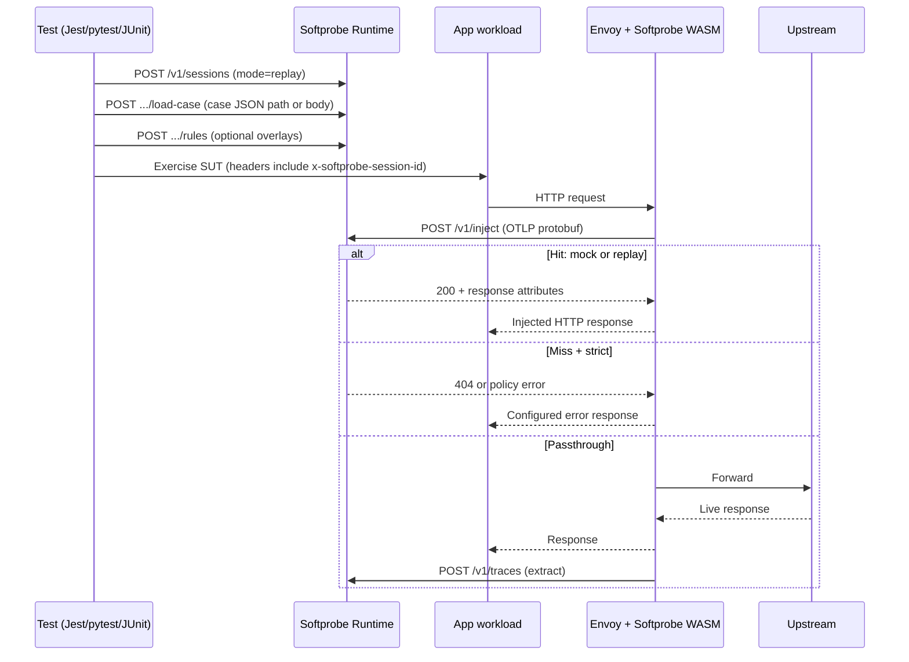

# Softprobe Hybrid Platform: Design Document

**Status:** Draft for implementation planning  
**Audience:** Engineers implementing runtime, proxy extension, SDKs, and CLI  
**Related contracts:** [platform-architecture.md](./platform-architecture.md), [http-control-api.md](../protocol/http-control-api.md), [proxy-otel-api.md](../protocol/proxy-otel-api.md), [session-headers.md](../protocol/session-headers.md)

---

## 1. Executive summary

Softprobe Hybrid unifies **HTTP capture, replay, and rule-based dependency injection** behind a **proxy-first** data plane (Envoy + Softprobe WASM) and a **language-neutral control plane** (session, case, rules, policy). Language-level framework patching (Express, Fastify, `fetch`, database drivers, and so on) is **optional** and out of the default product path, to reduce implementation cost for a small team.

Recorded behavior is stored as **one JSON file per test case**, containing an ordered list of **OpenTelemetry–compatible trace payloads** (not NDJSON streams). Test code in **Jest, pytest, or JUnit** controls mocks by **creating a session**, **loading cases and rules**, and ensuring the application’s traffic is tagged with a **stable session identifier** so the proxy can consult the runtime on the inject path.

This document specifies background, goals, concrete APIs, CLI shape, data artifacts, cross-language ergonomics, and **acceptance criteria** suitable for turning into an engineering task list.

---

## 2. Background

### 2.1 Prior state

Two implementations evolved in parallel:

- **JavaScript runtime (`softprobe-js`):** Strong deterministic replay and cassette concepts, but high maintenance cost: many framework and library patches (HTTP servers, clients, Postgres, Redis, and so on).
- **Proxy (`softprobe` / Envoy WASM):** Efficient transparent HTTP interception, OTEL-shaped inject/extract wire protocol, but injection lookup was not fully connected to a shared policy engine.

### 2.2 Problem

Instrumenting every framework is not viable as the **default** product for a startup. At the same time, **authentication and other control flows** are often HTTP-based and must be **mocked or replayed** during tests, not only outbound API calls. The platform needs:

- One **canonical** model for HTTP interactions and decisions.
- One **rule system** that applies to both capture and replay.
- A **simple way** for tests written in any mainstream language to **steer** injection without re-implementing matchers in each runtime.

### 2.3 Product thesis

| Layer | Responsibility |
|--------|-----------------|
| **Proxy (data plane)** | Intercept inbound and outbound HTTP; normalize request identity; call runtime for inject decisions; enforce passthrough / mock / error; upload extracts asynchronously. |
| **Runtime (control plane)** | Sessions, case files, rules, policy, matcher, ordering (e.g. consume-once), fixture auth seeds; answers inject lookups used by the proxy. |
| **Language SDKs** | Thin clients: create session, set policy, load case, register rules, attach headers; optional helpers for codegen and assertions. |
| **CLI** | Human and CI operations: capture, replay, rule packs, inspect, export, doctor. |

---

## 3. Goals

1. **Proxy-first HTTP:** Capture and inject **inbound and outbound** HTTP without requiring application code changes beyond routing traffic through the mesh and propagating session headers.
2. **Case artifacts:** Persist each scenario as **one JSON case file** with a **`traces` array** in **OTLP-compatible JSON** form (see §6), suitable for tooling, diffing, and optional export to collectors.
3. **Cross-language tests:** **Jest, pytest, and JUnit** (and similar) can **control injection** via a **small HTTP API** to the runtime and **session headers** on requests; no requirement to use a specific JS-only API in the application under test.
4. **Flexible rules:** Support **composable rules** (priority, scope, consume behavior, overrides) that combine with recorded traces, not a single flat mock table.
5. **Two execution modes:** **Replay** (deterministic playback + rules) and **Generate** (emit tests + fixtures using the same session and rule model).
6. **Contract-first:** Schemas and protocols in `softprobe-spec`; proxy and language repos implement **versioned** contracts.

### 3.1 Non-goals (v1)

- Mandatory patching of Express, Fastify, Axios, `fetch`, `pg`, Redis clients, and so on.
- Defining a second, parallel mock DSL unrelated to rules + OTEL-shaped spans.
- Replacing Istio/Envoy as the deployment model for the data plane.

---

## 4. Core concepts

| Term | Definition |
|------|------------|
| **Session** | A bounded test run context: holds mode, policy, loaded case, active rules, and optional auth fixtures. Identified by `sessionId`. |
| **Case** | One JSON file: metadata + **`traces[]`** (OTLP-compatible) + optional embedded **`rules[]`** and **`fixtures[]`**. |
| **Rule** | A **when** matcher + **then** action (mock, replay-from-case, passthrough, error, patch recording). |
| **Policy** | Session defaults: e.g. strict external blocking, allowlist hosts, default action on miss. |
| **Inject lookup** | Proxy sends OTEL protobuf to runtime (`POST /v1/inject` per [proxy-otel-api.md](../protocol/proxy-otel-api.md)); runtime returns hit (response attributes) or miss (`404`). |
| **Extract** | Proxy asynchronously uploads observed traffic (`POST /v1/traces`). |

---

## 5. Architecture

### 5.1 Control flow (replay mode)



### 5.2 Split of responsibilities

- **Proxy:** Never owns canonical rule evaluation semantics long-term; it **delegates** to the runtime for inject decisions. The proxy may keep **local caches** only as an optimization with explicit invalidation tied to session revision (see §8.4).
- **Runtime:** Owns matcher ordering, rule priorities, case indexing, strict policy, and “consume once” bookkeeping.
- **SDKs:** Serialize **session + headers**; optional ergonomics only.

---

## 6. Case file format (replaces NDJSON cassettes)

### 6.1 File model

- **One file per case**, e.g. `cases/login-with-oauth.case.json`.
- Top-level shape aligns with [case.schema.json](../schemas/case.schema.json): `version`, `caseId`, `traces`, optional `suite`, `mode`, `rules`, `fixtures`, `createdAt`.

### 6.2 Traces array

- **`traces`** is an **array of OTLP-compatible trace documents**.
- **Recommended encoding:** JSON equivalent of OTLP **`ExportTraceServiceRequest`** / **`TracesData`** resource-spans structure as produced by standard OTEL SDKs or the Softprobe recorder, so the same payload can be:
  - written to disk,
  - sent to an OTEL backend,
  - re-used for inject span construction.

**Illustrative shape** (logical, not normative field-for-field):

```json
{
  "version": "1.0.0",
  "caseId": "checkout-happy-path",
  "suite": "payments",
  "mode": "replay",
  "createdAt": "2026-04-05T12:00:00Z",
  "traces": [
    {
      "resourceSpans": [
        {
          "resource": { "attributes": [{ "key": "service.name", "value": { "stringValue": "api" } }] },
          "scopeSpans": [
            {
              "spans": [
                {
                  "traceId": "…",
                  "spanId": "…",
                  "name": "HTTP POST",
                  "attributes": [
                    { "key": "sp.session.id", "value": { "stringValue": "sess_abc" } },
                    { "key": "sp.traffic.direction", "value": { "stringValue": "outbound" } },
                    { "key": "url.full", "value": { "stringValue": "https://api.stripe.com/v1/payment_intents" } }
                  ]
                }
              ]
            }
          ]
        }
      ]
    }
  ],
  "rules": []
}
```

**Normative mapping** for Softprobe-specific attributes remains aligned with [proxy-otel-api.md](../protocol/proxy-otel-api.md) (e.g. `sp.session.id`, `sp.traffic.direction`, `http.request.*`, `http.response.*`).

### 6.3 Optional embedded rules

Cases may ship **default rules** (e.g. redact tokens) that the runtime applies unless the session **explicitly disables** `case.rules` or supplies higher-priority overlays.

---

## 7. How tests control HTTP injection (Jest, pytest, JUnit)

### 7.1 Mechanism

Tests do **not** call Envoy directly. They:

1. **Start or attach to** a **Softprobe Runtime** process (local sidecar, testcontainer, or cluster service for advanced setups).
2. **Create a session** with desired `mode` (`capture` | `replay` | `generate`) and **policy**.
3. **Load a case** and/or **register rules** through the [HTTP control API](../protocol/http-control-api.md).
4. Ensure **every HTTP request** that should participate carries:

   - `x-softprobe-session-id: <sessionId>` (required per [session-headers.md](../protocol/session-headers.md))
   - Optional: `x-softprobe-case-id`, `x-softprobe-mode`, `x-softprobe-test-name`

5. Run the scenario. The **proxy** includes the session id in OTEL inject/extract spans so the runtime can correlate.

### 7.2 Jest / Node example (illustrative)

```typescript
import { Softprobe } from '@softprobe/sdk';

describe('checkout', () => {
  let sp: Softprobe;

  beforeAll(async () => {
    sp = await Softprobe.connect({ baseUrl: process.env.SOFTPROBE_RUNTIME_URL });
  });

  beforeEach(async () => {
    const session = await sp.sessions.create({
      mode: 'replay',
      policy: { externalHttp: 'strict', defaultOnMiss: 'error' },
    });
    await session.loadCase({ path: 'cases/checkout.case.json' });
    await session.rules.upsert([
      {
        id: 'stripe-override',
        priority: 10,
        consume: 'many',
        when: { direction: 'outbound', host: 'api.stripe.com', pathPrefix: '/v1/payment_intents' },
        then: { action: 'mock', response: { status: 200, json: { id: 'pi_test', status: 'succeeded' } } },
      },
    ]);
    sp.currentSession = session;
  });

  it('charges successfully', async () => {
    await request(app)
      .post('/checkout')
      .set('x-softprobe-session-id', sp.currentSession.id)
      .send({ amount: 1000 })
      .expect(200);
  });
});
```

**Key point:** The **application under test** must receive the session header on **inbound** calls (test client → app) and the mesh must **propagate** it for **outbound** calls (app → dependency) according to deployment rules. Where automatic propagation is impossible, the SDK documents **explicit header forwarding** for the test harness only (not patching every HTTP client library).

### 7.3 pytest example (illustrative)

```python
import os
import pytest
import requests
from softprobe import Client

@pytest.fixture
def softprobe_session():
    client = Client(base_url=os.environ["SOFTPROBE_RUNTIME_URL"])
    session = client.sessions.create(
        mode="replay",
        policy={"externalHttp": "strict", "defaultOnMiss": "error"},
    )
    session.load_case(path="cases/checkout.case.json")
    yield session
    session.close()

def test_checkout(softprobe_session):
    headers = {"x-softprobe-session-id": softprobe_session.id}
    r = requests.post("http://app-under-test/checkout", json={"amount": 1000}, headers=headers)
    assert r.status_code == 200
```

### 7.4 JUnit 5 example (illustrative)

```java
@ExtendWith(SoftprobeExtension.class)
class CheckoutTest {
  @SoftprobeSession(mode = "replay", casePath = "cases/checkout.case.json")
  SoftprobeSession session;

  @Test
  void chargesSuccessfully() {
    var client = HttpClient.newHttpClient();
    var req = HttpRequest.newBuilder(URI.create("http://app-under-test/checkout"))
        .header("x-softprobe-session-id", session.id())
        .POST(HttpRequest.BodyPublishers.ofString("{\"amount\":1000}"))
        .build();
    var res = client.send(req, HttpResponse.BodyHandlers.ofString());
    assertEquals(200, res.statusCode());
  }
}
```

### 7.5 Auth and non-HTTP setup

- **HTTP-based OAuth/OIDC/SSO:** Handled by **case traces + rules** on the relevant inbound/outbound HTTP interactions.
- **Non-HTTP secrets or session material:** Use **`POST /v1/sessions/{id}/fixtures/auth`** (see control API) to register **tokens, cookies, or metadata** the runtime can surface to matchers or codegen, without patching frameworks.

---

## 8. Dependency injection model (rules + policy)

### 8.1 Decision space

Runtime evaluation for each candidate HTTP exchange returns a **decision**:

| Decision | Meaning |
|----------|---------|
| `MOCK` | Return a constructed response (from rule or synthesized from case). |
| `REPLAY` | Return the **next matching** recorded response from the loaded case according to matcher + ordering. |
| `PASSTHROUGH` | Allow live upstream (explicit rule or allowlist). |
| `ERROR` | Fail the request (strict policy or rule). |
| `CAPTURE_ONLY` | Used in capture mode: record, always forward (policy-dependent). |

The proxy maps these to: **inject attributes** (mock/replay), **forward** (passthrough), or **local error response** (error).

### 8.2 Rule structure

Rules align with [rule.schema.json](../schemas/rule.schema.json):

- **`id`:** Stable identifier for diffs and codegen.
- **`priority`:** Higher wins on conflict (explicit numeric total ordering).
- **`consume`:** `once` | `many` — controls whether a matching **replay** interaction is **dequeued** from the case.
- **`when`:** Matcher object (direction, service, host, method, path, pathPrefix, header predicates, body JSONPath subset, trace tags).
- **`then`:** Action + payload (response spec, status template, latency, fault injection).

**Example rule pack (YAML):**

```yaml
version: 1
rules:
  - id: block-unknown-external
    priority: 1000
    consume: many
    when:
      direction: outbound
      notHostSuffix: [.internal, localhost]
    then:
      action: error
      error:
        status: 599
        body: { "error": "external call blocked in strict mode" }

  - id: stripe-replay
    priority: 100
    consume: once
    when:
      direction: outbound
      host: api.stripe.com
      method: POST
      pathPrefix: /v1/payment_intents
    then:
      action: replay
```

### 8.3 Composition order

1. **Session policy defaults** (strictness, allowlists).
2. **Case-embedded rules** (shipped with recording).
3. **Session rules** (test-local overlays, highest priority wins on ties by `priority` field).

### 8.4 Session revision and caching

Every mutating call (`load-case`, `rules`, `policy`, `fixtures`) bumps a **`sessionRevision`**. The proxy may cache inject results **only** when keyed by `(sessionId, sessionRevision, requestFingerprint)`.

---

## 9. CLI design (revised)

Design principle: **CLI verbs map 1:1 to control-plane concepts** (session, case, rules, policy, export), not to one-off hacks.

| Command | Purpose |
|---------|---------|
| `softprobe doctor` | Check runtime reachability, proxy headers, schema versions. |
| `softprobe session start --mode replay` | Create session; print `sessionId` for export to env. |
| `softprobe session load-case --session $ID --file cases/x.case.json` | Load traces/rules from disk. |
| `softprobe session rules apply --session $ID --file rules/stripe.yaml` | Apply rule pack. |
| `softprobe session policy set --session $ID --strict` | Toggle strict external HTTP. |
| `softprobe capture run --target http://app:3000 --out cases/new.case.json` | Orchestrated capture (wraps session `capture` + extract aggregation into one case file). |
| `softprobe replay run --session $ID` | Validate session + print inject statistics (optional dry-run). |
| `softprobe inspect case cases/x.case.json` | Summarize spans, hosts, directions, diff-friendly view. |
| `softprobe export otlp --case cases/*.case.json --endpoint $OTLP` | Push case traces to OTLP HTTP/gRPC endpoint. |
| `softprobe generate test --case cases/x.case.json --framework vitest|jest|pytest|junit` | Emit test skeleton + fixture references using the **same** session API. |

**Flags common to many commands:** `--runtime-url`, `--json` (machine output for agents), `--trace`.

---

## 10. API summary (control vs data plane)

| API | Transport | Owner |
|-----|-----------|--------|
| Session / rules / policy / fixtures | JSON over HTTP ([http-control-api.md](../protocol/http-control-api.md)) | Runtime |
| Inject lookup / extract upload | OTEL protobuf ([proxy-otel-api.md](../protocol/proxy-otel-api.md)) | Proxy ↔ Runtime |

Tests and SDKs use **only** the control API. The proxy uses **only** the OTEL inject/extract API.

---

## 11. Security and safety

- **Session ids** are capabilities: treat as secrets in shared environments; support **short TTL** and **explicit close**.
- **Strict mode** must default to **fail closed** for unexpected outbound traffic in CI.
- **Redaction rules** should run on **extract** path before persistence or export.

---

## 12. Acceptance criteria

### 12.1 Artifacts

- [ ] A valid **case file** validates against `case.schema.json` and contains **`traces` as an array** of OTLP-compatible JSON documents.
- [ ] Documented **golden example** case files in `softprobe-spec/examples/cases/` match the schema.

### 12.2 Runtime

- [ ] `POST /v1/sessions` returns a `sessionId` and initial `sessionRevision`.
- [ ] `load-case`, `rules`, and `policy` endpoints bump `sessionRevision` monotonically.
- [ ] Inject lookup resolves **rules + case replay** in the documented composition order.
- [ ] `consume: once` replay entries are **dequeued** exactly once per matching request.

### 12.3 Proxy integration

- [ ] For tagged traffic, proxy calls **`POST /v1/inject`** and honors **hit vs 404** per [proxy-otel-api.md](../protocol/proxy-otel-api.md).
- [ ] Extract path sends **`POST /v1/traces`** without blocking the request path beyond configured timeouts.

### 12.4 Cross-language

- [ ] Reference tests demonstrate **Jest**, **pytest**, and **JUnit** creating a session and passing **`x-softprobe-session-id`** through to the SUT.
- [ ] Failure modes (runtime down, unknown session, strict miss) produce **actionable errors** in each SDK.

### 12.5 CLI

- [ ] `softprobe doctor` and `softprobe session start` work against a local runtime with **JSON output mode** suitable for automation.

### 12.6 Codegen

- [ ] Generated tests compile and use **only** public SDK + session APIs (no private protobuf fields in user code).

---

## 13. Implementation phases (task-list friendly)

| Phase | Scope |
|-------|--------|
| **P0** | Finalize JSON schemas for case traces OTLP profile; golden fixtures; runtime session store; inject resolver MVP (replay + mock rules). |
| **P1** | Proxy ↔ runtime integration end-to-end; strict policy; extract to case file writer (one file per case). |
| **P2** | JS + Python + Java SDK thin clients; Jest/pytest/JUnit examples; `softprobe` CLI wrapper. |
| **P3** | Codegen; OTLP export from case files; performance caching with sessionRevision. |
| **P4** | Optional deep instrumentation packages (`@softprobe/js-http-hooks`, and so on) **behind** feature flags. |

---

## 14. Open questions

- Exact **OTLP JSON** canonical subset (field naming and size limits) for case files vs on-the-wire protobuf.
- Whether **inbound** replay should support **full duplex** streaming in v1 or scope to **request/response** HTTP only.
- Multi-tenant runtime: **namespace** session ids per org vs global UUIDs.

---

## 15. Document history

| Version | Date | Notes |
|---------|------|--------|
| 0.1 | 2026-04-05 | Initial hybrid design: case JSON + OTLP traces, proxy-first, cross-language control, rules/CLI revision |
