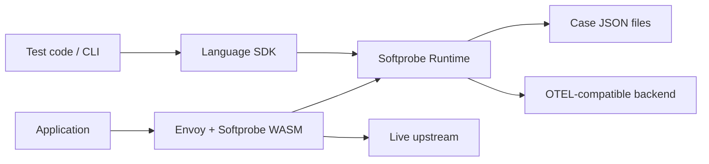

# Softprobe Platform Architecture

This document is the canonical shared architecture for the Softprobe platform.

Related docs:
- [Repo layout](./repo-layout.md)
- [Migration plan](./migration-plan.md)
- [HTTP control API](../protocol/http-control-api.md)
- [Proxy OTEL API](../protocol/proxy-otel-api.md)
- [Session headers](../protocol/session-headers.md)

---

## 1) Background

Softprobe combines two main capabilities:

- transparent HTTP interception through proxy technology
- deterministic dependency replay and injection for testing

The platform must scale beyond JavaScript to Python and Java. Therefore, the architecture must be defined independently of any single language implementation.

---

## 2) Architecture principles

- proxy-first for HTTP capture and replay
- shared contracts defined outside any language repo
- one control-plane model for sessions, rules, cases, and decisions
- language-specific SDKs provide ergonomics, not divergent semantics
- optional deep instrumentation stays outside the default product path

---

## 3) Top-level components

### `softprobe-spec`

Owns:

- case schema
- rule schema
- session model
- decision protocol
- header protocol
- compatibility fixtures

### `softprobe-proxy`

Owns:

- Envoy/WASM data plane
- HTTP interception
- normalization
- OTEL/protobuf lookup against Softprobe backend
- enforcement of inject/passthrough/error outcomes
- async extraction of observed exchanges

### Language repos

Examples:

- `softprobe-js`
- `softprobe-python`
- `softprobe-java`

Each language repo owns:

- test SDK
- CLI or wrapper commands
- code generation for that language
- runtime client, and optionally a local runtime implementation

---

## 4) Control plane and data plane split

The most important platform boundary is:

- proxy is the HTTP data plane
- runtime is the replay and policy control plane

The proxy must remain simple. It should not own the rule engine or the canonical replay semantics.

### 4.1 Control plane boundary with Istio

Softprobe runs under Istio, so there are two control planes touching the same proxy at different layers.

That is acceptable only if the ownership boundary is explicit:

- Istio owns proxy configuration
- Softprobe owns request-time decisions inside the Softprobe extension

Istio control-plane responsibilities:

- proxy lifecycle
- xDS and filter-chain configuration
- routing
- workload attachment
- security and mTLS policy
- static WASM plugin configuration

Softprobe control-plane responsibilities:

- test sessions
- case loading
- rule evaluation
- dependency injection decisions
- capture/extract policy
- replay policy

Softprobe must not mutate Envoy topology or compete with Istio for routing authority. The Softprobe runtime is a decision service behind a statically configured Envoy filter, not a second mesh control plane.

---

## 5) Core shared concepts

The following concepts must be stable across all languages:

- `case`
- `session`
- `rule`
- `policy`
- `fixture`
- `decision`

These concepts are part of the product contract, not implementation details.

---

## 6) Case model

A case is one JSON artifact for one test scenario. It may contain:

- metadata
- one or more OTEL-compatible traces
- stored rules
- fixtures

The case file is the primary developer replay artifact.

---

## 7) Session model

A session is one active test control scope. Sessions allow test code to control proxy behavior indirectly.

Session state includes:

- session id
- case id
- mode
- rules
- policy
- optional fixtures

The session id is propagated on requests so proxy lookups can be resolved against the correct test context.

---

## 8) Rule model

Rules are the primary dependency injection mechanism. Rules match on normalized HTTP identity and control what data the runtime should return to the proxy and what traffic should be extracted.

The proxy code shows two different concerns:

1. forwarding decision
2. extraction policy

Those must stay separate in the shared model.

### 8.1 Request-path lookup behavior

The proxy-facing wire contract is not a JSON decision envelope.

For `/v1/inject`, the current proxy design is:

- request body: OTEL protobuf `TracesData` with `sp.span.type = "inject"`
- `200` + OTEL protobuf response carrying `http.response.*` attributes => inject returned data
- `404` => miss, passthrough upstream
- other non-success responses => error/failure path

### 8.2 Extraction policy

- `extract`
- `skip`

`extract` is not a forwarding decision. It is a side-effect policy used when Softprobe persists or exports observed HTTP exchanges.

This matches the proxy implementation:

- injection lookup happens on the request path before upstream forwarding
- extraction save happens asynchronously on the response path for non-injected traffic

So the canonical model should be:

- proxy wire protocol:
  - `/v1/inject` using OTEL protobuf and `200`/`404` semantics
  - `/v1/traces` using OTEL protobuf for extraction uploads
- higher-level test/session APIs may still use JSON for ergonomics

Rule precedence must be deterministic and shared across implementations.

---

## 9) Modes

### `capture`

- capture HTTP traffic
- write case data
- optionally export to OTEL-compatible backend

### `replay`

- resolve HTTP decisions from rules and recordings
- block unmatched traffic in strict mode unless policy allows it

### `generate`

- generate test code from case files using the same public API

---

## 10) Initial recommendation

Short term:

- keep the reference runtime in `softprobe-js`
- move shared truth into `softprobe-spec`

Long term:

- allow all language SDKs and the proxy to depend on the same versioned contracts
- extract a standalone runtime only when multi-language pressure justifies it
